# Bookworm Kid


Bookwormkid is an application which can be used in real life by anyone who is interested in supporting their child's, grandchild's or pupil's reading journey and help them fall in love with reading. I am sure there is no need to explain why reading skills are important for the development of the child, but detailed information can be found [here](https://www.highspeedtraining.co.uk/hub/why-is-reading-important-for-children/), if interested.

The app's main purpose is to provide age appropriate literature for all kinds of readers which would take their reading levels into account, so no reader is dissuaded or discouraged by too difficult a text, but also recommending interesting and enticing literature for avid and passionate readers whose reading skills are above average for their age group.

Reading doesn't come easily to everyone and while some child might be able to read his way through Harry Potter or even The Lord of the Rings at the age of 7, other children might find it difficult to read through much simpler stories at a much higher age.

Having observed many children in their early reading journey, I can tell each road to proficient reading is different and just as a reluctant reader can be put off by too difficult a text or a "baby" story, so can a prolific reader be dissuaded by a story which isn't age appropriate or interesting enough.

As a mother of four young children I have always strived for them to acquire and improve their reading skills from early on. I provided lots of Montessori materials for them and other aids to help them on the journey to becoming proficient readers. However, when I was looking for books that would be appropriate for their age and reading level, I often couldn't find books which would correspond to their current needs and skills and maturity level. This was especially true about their native languages which are Czech and Slovak. The books which are available for early readers in these languages are often way too difficult, too long, unintestring or plain and definitely couldn't serve as a source of joy to the early avid or struggling readers.

In the English speaking countries, the reading system is much better developped, well throught-through and adjusted to different ages and reading skills/levels. Children can pick a book which is the right level for them and take it from there.

However, even in the English speaking environment, it is not easy to find books which would not be only age or skill appropriate, but both at the same time. Even a great [online resource](oxfordowl.com) which provides great age segmentation for young readers, doesn't provide interesting content for struggling readers of a higher age or profilic young readers. (I'm sure no struggling 8 year old would want to read "A very hungry caterpillar" or "Biff, Chip and Kipper" series which might correspond to their reading level if they are reluctant readers, but wouldn't correspond to their age or maturity level.)

I have heard of software available to schools which can diagnose a child's reading level and suggest books which would be age appropriate at the same time. However, this software is not available to broad public and it is very hard to find fun books for reluctant and struggling readers who need to be pulled into an age appropriate story.

Most of the major bookstores which I have browsed through do provide segmentation taking age into account, but often it is too broad: early readers, first-grade readers, young adults, and none of these have subsegments for struggling, average or avid readers.

Thus I would like to fill this market niche with this online bookstore which would cater for a specific age segment (6-12), early/young readers, but would take the children's reading skills and maturity into account.

At this stage the bookstore is focused on English literature only, but it is my deepest wish for children all over the world to have access to literature which will transport them into a different world and make their lives richer in their own langauges whatever their reading skills are.

You can access the Bookwormkid app here:
[Bookworm Kid](https://bookwormkid-c20568b2004e.herokuapp.com/)

[Back to top](#contents)

If you wish to make a test purchase, you can use the following [Stripe Dummy Card](https://stripe.com/docs/testing) details:

- Success Card Number: 4242424242424242
- 3D Secure Auth Number: 4000 0027 6000 3184
- Exp Date: Any date in the future using the format MM/YY
- CVN: any 3 digit number
- Postcode: any 5 numerals

Any payments made using a valid debit/credit card will not be processed and the card will not be charged. No orders made will be fulfilled.

For full Admin access to Django Admin panel with relevant sign-in credentials: [BookWorm Kid Admin](https://bookwormkid-c20568b2004e.herokuapp.com/admin/)

For access to Admin Dashboard frontend view with relevant sign-in credentials: [BookWorm Kid Admin Dashboard](https://bookwormkid-c20568b2004e.herokuapp.com/bookstoremanagement/bookstoremanagement)

[Back to top](#contents)

# Contents

- [Bookworm Kid](#bookworm-kid)
- [Contents](#contents)
- [Project](#project)
  - [Objective](#objective)
  - [Cutomer Goals](#cutomer-goals)
  - [Business Goal](#business-goal)
  - [Business Model](#business-model)
  - [Marketing Techniques](#marketing-techniques)
  - [Project Management](#project-management)
    - [GitHub Projects Board](#github-projects-board)
    - [MoSCoW Prioritization](#moscow-prioritization)
    - [Milestones](#milestones)
    - [Epics](#epics)
    - [Sprints (Milestones)](#sprints-milestones)
  - [Database Schema (ERD)](#database-schema-erd)
- [User Experience (UX/UI)](#user-experience-uxui)
  - [User Stories](#user-stories)
  - [Design Choices](#design-choices)
  - [Design Prototype (Wireframes)](#design-prototype-wireframes)
  - [Site Structure](#site-structure)
- [Features](#features)
  - [User View - Guests/Account Holders](#user-view---guestsaccount-holders)
  - [CRUD Functionality](#crud-functionality)
  - [Features Details](#features-details)
  - [Future Features](#future-features)
- [Technologies Used](#technologies-used)
  - [Languages](#languages)
  - [Frameworks and Software](#frameworks-and-software)
- [Python Packages](#python-packages)
- [Testing](#testing)
    - [Manual testing](#manual-testing)
    - [External Testing](#external-testing)
    - [Automated Testing](#automated-testing)
- [Project Deployment](#project-deployment)
  - [Create a new GitHub Repository from CI template](#create-a-new-github-repository-from-ci-template)
  - [Install Django and the supporting libraries](#install-django-and-the-supporting-libraries)
  - [ElephantSQL Database](#elephantsql-database)
  - [Heroku Deployment](#heroku-deployment)
  - [Google Mail Setup](#google-mail-setup)
  - [AWS Config](#aws-config)
    - [Media Folder Setup](#media-folder-setup)
    - [Django AWS Connect](#django-aws-connect)
  - [Stripe Config](#stripe-config)
  - [To fork the repository on GitHub](#to-fork-the-repository-on-github)
  - [To create a local clone of a project](#to-create-a-local-clone-of-a-project)
- [Credits](#credits)
  - [Content](#content)
  - [Tools](#tools)
  - [Media](#media)
  - [Acknowledgements](#acknowledgements)

[Back to top](#contents)

# Project

## Objective

I have always had a passion for reading and had a desire for others to enjoy this activity and benefit from it. Many adults who are not great readers today most likely lost their interest in reading when they were young and perhaps were struggling with reading fluently or with finding interesting books they would enjoy. Often it takes one great book for a child to become interested and they make a leap into the world of books from there. But for others, the road is not so easy and they need more support, help and guidance.

It is my desire that every child falls is love with reading.

I realize that if the book offer on this app was comprehnsive and complete, it could easily be used by teachers or librarians to easily find books for their young readers.

From the technical perspective, when developing this project, my goal was to put my knowledge of HTML, CSS, JavaScript, Python, Bootstrap and Django Framework to use. Attaching Stripe functionality simulates the possibility to pay for the products which is a necessary feature of any eshop.

## Cutomer Goals

The main goal of the customer is to find interesting age and reading level appropriate books for their chidren, grandchildren or pupils. The customers are provided with a search field to quickly find books they are looking for and with highly customized filters to be able to search in more than one category. The customers can find supporting articles and join the community on Facebook or sign up for a monthly newsletter to be informed about the new tidings within the company. The customers can leave book reviews to express their opinion.
## Business Goal

Bookworm Kid provides a range of books for all young readers no matter what their reading skill is, so they can discover the world of books and fall in love with reading.

Bookworm Kid strives to create a community of parents, teacher, librarians who could contribute with their tips for great books for young readers and at the same time find support on their journey of helping young readers discover the world of books. The articles, newsletter, contact form, reviews and community readings aim to attract like-minded people with similar desires and facilitate their search for the best books for their young ones.

Once the book offer has been amplified with consulation from experts on childrens' literature, this app could also be used as a search tool for finding the best books by teachers, librarians and others.

Bookworm Kid provides a very user friendly interface for bookstore admin where they can add/edit/delete books from the store, manage articles and enquiries. The admin can access all order details in the django admin panel and also can approve customer reviews.

## Business Model
Bookworm Kid was designed as a B2C - Business to Customer model - where the customer buys directly from the business. There are no intermediaries. This model enables direct communication with the customer and provides space for flexibility and quick reactions and adaptability to the customer's needs.

## Marketing Techniques
It is absolutely necessary to have online presence and recognition to be able to attract new customers and build a strong customer base. One of the ways to achieve this is through social platforms, e.g. the Facebook platform. Social media can be a great tool for attracting new customers and communicating with the current ones, if done correctly.

* Facebook Page
 A commercial Facebook page was created to make the potential customers aware of the business, its goals and to create a community around book lovers. We hope that through regular engagement with potential customers through posts, and other activities, we will be able to attract new customers. Facebook page will help us keep in touch with the current customers and provide a way for communication with new ones. We will be announcing new arrivals, featured products or special sales on this platform. Also when a new article is released/published, the users will be informed. When a new live reading session for children (which are very popular and will contribute to the organic growth of the store) takes place, the users will be informed about this upcoming event on our Facebook page. In the future we are considering using targeted ads, once our platform is robust enough.

<details><summary><b>Facebook Page</b></summary>


</details><br>

* Content marketing

There are several articles present on the Bookworm Kid website with the purpose of attracting potential customers to read up on the topic of the importance of reading and ways to improve children's reading skills. At the moment, all of the articles are guest articles, but in the future we plan to add our own content and engage more deeply with the users.

* E-mail Marketing
Another form of online marketing is through email. Bookworm Kid users can opt to subscribe to the company's newsletter. The content of the newsletter is kept short and fresh with the purpose to attract the customers to the store. New arrivals, featured products, sales will be announced through this platform. Also if there is a new interesting article or a new reading session, we will be letting the customers know. Lastly, the users will receive discount codes for their next purchase (future feature). [Mailchimp](https://mailchimp.com/) was used to set up the newsletter subscription functionality.

* Search Engine Optimization (SEO)
If a website does not come up in the google search on one of the top positions, it is very unlikely the users will ever visit is. Having sufficient traffic is a prerequite for customer conversion. One of the ways how to come up higher in searches is through Search Engine Optimization. If the ranking is good/high, there is a higher return on investment.

Therefore it is Bookworm Kid's goal to include content which is reliable, profesional and relevant. Descriptive Meta Tags have been implemented on the site in hope of increasing the SEO. Most of them are a result of several brainstorming sessions, but I also used [Wordtracker](https://www.wordtracker.com/) to add more content specific keywords. I made sure to use not only short, but also long-tail words. The Meta Tags used:

    * Meta Description - "Bookworm kid is a webstore that sells books for young children taking not only their age but also their reading skills into account. Encourage your young reader. Come and find the best book for your child."

    * Meta Keywords - books by-age, books by-reading skills, reluctant reader, keen reader, struggling reader, avid reader, age appropriate books, slow reader, happy reader, fast reader, exciting books for kids, children's bookstore online, online children's bookstore, encourage children to read, child hates reading

The site also includes a sitemap.xml and robots.txt to make sure that the search engines can find and crawl the pages on the site. These files are essential for SEO optimization. The sitemap.xml was generated using [XML Sitemap Generator](https://www.xml-sitemaps.com/) and included in the root folder of the project. A robots.txt file was created in the root folder to instruct search engine crawlers on how to access and crawl the site's pages.

## Project Management

I have been using GitHub projects for organizing my project, tracking user stories and epics. It is a very helpful tool which enabled me to keep all my PBIs in one place and to tackle them gradually.

At the beginning of the project, I spent a fair amount of time on project planning, on thinking it through. I created wireframes and a sketch of my models first. Having the wireframes and the ERD model to refer to when working on the project was both essential and very helpful. Any time I was getting lost or confused, I could consult them and figure out how to proceed.

Reflecting back on my experience with PP4, I felt more confident about planning of the sprints and I planned them right at the beginning. I did make minor changes to the content of each milestone, but in general my sprints followed this logic: focus on essential features first (mvp), add additional features if there is enough time. I also focused on issues with high priority and only when the project was taking shape, would I add a could have or lower priority features. I also improved in guessing have many story points should each user story/dev tasks take, but I had not yet planned to do a given number of points withing the sprint.

When I am finished with the project, I plan to go back and analyze how many story points I was able to achieve in a sprint and will use this information for my future project planning.

I used Milestones for organizing my sprints. I know it is not ideal, but the Project tool does not have a great alternative to tracking sprints. Thus, I would create my milestones, give them a description, assign Epics and User stories to them and add a finish date for each of them. My sprints were usually one week long Monday to Friday, but sometimes I had to move some issues to the next sprint due to a problem which took me longer to solve than I had expected or I managed to squeeze in some US story into the current sprint.

From the beginning I tried to update my readme and testing files, especially as regards credits, sources and bug-fixes. I left the last two sprints for readme and testing file completion as it is a very time consuming task to document everything.

I tried to fix bugs, small or big, as I went so that they would not be too much left at the end. Also it gave me a great relief when the app would start working again after having displayed error upon error.

As you will see from my progress, I have always kept MVP in mind. At first I made sure the backend functionality was in place, then I started working on other crucial elements and when I had some extra time, I added some nice to have features, but always keeping in mind meeting the core project requirements first.

This is visible especially with the product filtering, where at first I developed only a basic filtering functionality by skill level and some other model attributes. It took me a long time until I got around doing the age filtering, but I felt this was an essantial feature of the app and needed to be done. Again, I started with a simple age filter which did not take any other parameters in the account. Finally, towards the end of my development, I managed to create filters which take more than one criterion into account and I am very happy with the result. In the meantime I would add other essential features to comply with the mvp requirements, like newsletter, contact form, articles, enquiries and others.

Overall, primarily, I focused on completing majority of the must-haves, in later stages of the product development I would consider some should and could-haves. At the same time, I was identifying user stories which would have to change into won't haves and be left for future development.

Breaking up the project in Epics, User stories and essentially into tasks has been very helpful and enabled me to tackle the project in managable bite-size steps. Using acceptance criteria as a part of my user stories helped me define what was necessary to achieve before I could consider the user story done. Each user story also contained detailed tasks which had to be fulfilled before labeling the story as done.

Each of the user stories would get labels such as: must have, should have, could have, won't have; number of story points; epic ; user story/dev task/bug; high/medium/low priority. Each user story would be assigned to its respective epic and milestone (sprint).

[Back to top](#contents)

### GitHub Projects Board

I used Projects tool inbuilt in GitHub, [GitHub's Projects](https://github.com/users/lucia2007/projects/9), to help me manage the scope of the project, to track my progress and record any bugs, but also to jot down any ideas that were relevant for the application development. These ideas were either later applied in the code or dismissed if they did not seem to enhance the user's experience or improve the development process. The issues were being fluidly moved from PBIs into In Progress and then either into Done or Won't have. Anytime I came across a bug, I noted it down with as many details as possible in the bug section and continuously worked on fixing them.

Whenever I had an idea related to the project, I would jot it down in the "Backlog section/Brainstorming" section. Then I would go through the issues and choose the ones suitable for the current Milestone. I would convert the simple ideas into proper User Stories with acceptance criteria and necessary tasks and move them to the To Do/In Progress section. I would label each User Story with the following labels: MoSCoW lables, number of story points, relevant Epic and Milestone, priority, user story/dev task/bug-fix. The dev tasks were usually centered around the backend part of the project, getting the frameworks set up and functional, or fixing bugs, writing documentation or testing.

When my Milestone with its deadline was set up (Sprint), I would assign relevant Epics with their User Stories to it. On a day-to-day basis I would choose 2 or 3 things that were currently being worked on and I would place them in the "In Progress" section. I also took some extra time, usually on a Friday afternoon or Monday morning to do a more thorough clean up of the project board so that it would remain usable and not be too cluttered. (Sometimes I wrote the same bug/issue down more than once or I had more than 2-3 issues in my In Progress section.) If I became stuck on a task for whatever reason or depended on external input, I moved it to "Blocked". At last, when a task was completed, I would one more time check against the acceptance criteria, tick each of the finished tasks and move it to the "Done" section. As soon as an issue was identified as "won't have" for the current project version, I moved it to the won't do section on the project board.

The Project tool has been very benefitial for my development process, especially because I could rely on having all the relevant information in one place. I would write down the sources to be credited, or bugs to be fixed or ideas on how to improve some part of the application, so I did not have to worry about having forgotten something essential.

In the future, I should able to surmise the amount of story points for each Epic/User story more easily and thus plan my Sprints more effectively. In the past I noted down the bugs only retrospectively. This time around I tried to create an issue for each bug right away and tried to connect a commit to the issue, but I didn't do it quite consistently. I hope this process becomes a second nature to me in the future and I won't be forgetting to attach the issue number to a commit. What was definitely benefitial, was that I documented each bug and its solution in the testing file as soon as I had solved it.

[Back to top](#contents)
### MoSCoW Prioritization

I had tried to apply MoSCoW principles in my development but more on a project basis than on a sprint basis. In my first sprints I solely focused on meeting must-have dev tasks and user stories and when most of my necessary features were in place, only then did I start incorporating should-haves or could-haves. As I went along, I also indentified won't-haves which were either to be fully abandoned or left for future development.

- Must Have: must be delivered (max 60% of user stories)
- Should Have: add significant value, but not crucial (20% of stories)
- Could Have: small impact if not implemented (20% of stories)
- Won't Have: not crucial for this iteration

Unfinished user stories can be found in either PBis, to-do or the won't have section of my project board.

[Back to top](#contents)
### Milestones

I split up my project development into the following milestones:

1. Project planning, project set up, Django Allauth
2. Product Model set up/Page skeleton/Database set up
3. Shopping Bag/Checkout page/User Profile/STRIPE
4. Deploy/Newsletter sign up
5. Blog/Contact Form/Wishlist
6. Age segmentation/Add more products to the shop/Bookstore management/Bug fixes/Confirm deletion
7. Facebook mockup/Marketing (keywords)/Finish Age segmentation/Code refactoring/Fiinish up Footer/Navbar content/
8. and  9. Testing/Readme/Marketing/SEO/missing files
10. Project Submission

For more details please see the sprints (milestones) below.

[Back to top](#contents)
### Epics

Each milestone was split into epics. Some milestones contain just one or two epic, others contain more.

Each epic would contain several user stories. Each user story has a description, acceptance criteria and tasks which had to be ticked before the user story could be closed and moved to done. For details please refer to my [Projects](https://github.com/users/lucia2007/projects/9).

- EPIC Registration and User Account
  - DT Preparation for Project Planning
  - US User Registration
  - US Login/Logout Functionality
  - US Account Email Validation
  - US User Profile
- EPIC Viewing and Navigation
  - US Navigation
  - US Visual confirmation for shopping bag/wishlist items
  - US Home Page
  - US View All Products
  - US Product Detail View
  - US Product Category/Specials Filter
  - US Footer
  - US Optimize footer for small devices
  - US Add Terms and Conditions, Privacy Policy
- EPIC Book Details
  - US Add Products to the Database
  - US Add Read more/Read less functionality
- EPIC Shopping Bag Functionality
  - US Shopping Bag
  - US Checkout
  - US Add Products to Bag
  - US Order Sorting
  - US Shopping bag icon/functionality available from all books view
  - US Sales Price Functionality
  - US User Notifications (Toasts)
  - US Order Email Confirmation
- EPIC Filtering
  - US Filtering according to skill levels, special offers features
  - US Product Category/Specials Filter
  - US Add age segmentation filtering
  - US Add age segmentation for all product views and filters
  - US Add double filtering for products according to different segments&age
  - US Make the chosen age parameter visually clear
- EPIC Sorting and Searching
  - US Search Functionality
  - US Product Sorting Functionality
  - US Sorting according to sales price
- EPIC Articles
  - US View all Articles
  - US View Article detail
  - US Add Articles to the app (add, edit, delete functionality)
  - US Like/Unlike Articles
  - US View Likes
- EPIC Customer Communication and Advertisement
  - US Contact
  - US Newsletter
  - US Create Facebook Page
  - US Frequently Asked Questions - FAQ
- EPIC Error Pages
  - DT Add customized 403, 404, 500 Error Pages
- EPIC Wishlist
  - US Wishlist
  - US Wishlist icon changes colour when there is an item in the wishlist
  - US Wishlist visual confirmation
- EPIC Store Management
  - US Bookstore Management
  - US Toasts without Shopping Bag
  - US Admin Dashboard
  - US Confirm Deletion

[Back to top](#contents)

### Sprints (Milestones)

My sprints were planned out as follows:

**Sprint #1 - 04/09 - 08/09**

Project planning, project set up, Django Allauth

In the first sprint I focused on project planning: I created wireframes, ERD schema, wrote down user stories, planned sprints and set up the project including the Django allauth. Most of this sprint was about setting up the backend and the tasks were labeled as Dev Task (DT). The following tasks where a part of this sprint:

- DT - Preparation for Project Planning
- DT - Set Up Development Environment
- US - User Registration
- US - User Login/Logout Functionality
- US - Account Email Validation

**Sprint #2 - 11/09-15/09**

Product Model set up/Page skeleton/Database set up

In this sprint, I focused on creating the backend functionality for displaying products on offer, enable filtering and sorting and search functionality.

- US - Home Page
- US - Navigation
- US - Footer
- US - View All Products
- US - Product Detail View
- US - Product Sorting Functionality
- US - Search Functionality
- US - Filtering according to Skill Level, Special Offers, Featured
- US - Product Category/Specials Filter
- DT - Add Products to the database

**Sprint #3 - 18/09-22/09**

Shopping Bag/Checkout page/User Profile/STRIPE

I created shopping bag and checkout page functionality, customized user registration/login functionality, started working on implementation of Stripe payment system.

- US - Shopping Bag
- US - Checkout
- US - User Notifications (Toasts)
- US - Order Email Confirmation
- US - Add Products to Bag
- DT - Add customized 403, 404 and 500 Error Pages
- Several bug-fixes (details in testing.md)

**Sprint #4 - 25/09-29/09**

Deploy/Newsletter sign up/CSS style improvements/Basic Admin Dashboard

In this sprint I focused on early deploymentmadding newletter sign up functionality, improving app styling and added basic admin dashboard for adding products.

- US - Newsletter
- US - Visual Confirmation for shopping bag/wishlist items
- Several bug fixes (details in testing.md)

**Sprint #5 - 02/10 - 06/10**

Blog/Contact Form/Wishlist

In this sprint I added Blog, contact form and wishlist and made small improvements to admin dashboard.

- US - Admin Dashboard
- US - Wishlist Icon Changes Colour when there is an Item in the Wishlist
- US - View Article detail
- US - View All Articles
- US - Add Articles to the App (add, edit, delete functionality)
- US - View Likes
- US - View Like/Unlike articles
- US - Wishlist
- US - Contact
- US - Shopping Bag icon/functionality availabla from all books view

**Sprint #6 - 09/10 - 13/10**

Age segmentation/Add more products to the shop/Bookstore management/Bug fixes/Confirm deletion

In this sprint I managed to basic filtering by age, I added more products to the shop, significantly improved Bookstore Management, fixed bugs and added confirm deletion messages to relevant places.

- US - Order Sorting
- US - Confirm Deletion
- US - Toasts without Shopping Bag
- US - Add Age segmentation Filtering
- US - Add Read more/read less Functionality
- US - FAQs
- US - Bookstore Management

**Sprint #7 - 16/10 - 20/10**

Facebook mockup/Marketing (keywords)/Finish Age segmentation/Code refactoring/HTML Error Fixes/Finish up Footer/Navbar content

In this milestone I focused on finishing the last features, I started refactoring the code and fixing HTML errors (duplicate ID's). I also finished up the Footer and Navbar Content. At my mentor's suggestion, I added a product review functionality.

- US - Add Age Segmentation for all Product Views and Filters
- US - Add Terms and Conditions
- US _ Sales Price Functionality
- US - Optimize Footer for Small Devices
- US - Create Facebook Page
- US - Sorting according to Sales Price
- US - Add Dobule Filtering for Products according to Different Segments & Age
- US - Make the Chosen Age Parameter Visually Clear
- US - Product Review

**Sprint #8 + #9 - 23/10 - 03/11**

Testing/Readme/Marketing/SEO/Missing Files

The main focus of these sprints was to update the readme file and do through testing of the whole app, including python, javascript, html validation, user story testing, lighthouse testing. Towards the end of the two weeks, I will add the robots.txt, sitemap.xml, and focus on improving of the SEO score.

- US - Lets the user review a book only once
- US - Wishlist visual confirmation
- US - There are no past orders/no books found

**Sprint #10 - 06/11 - 07/11**

Project Submission

The above listed user stories above had all been finished. There are several user stories which had not been done and are postponed for future development, others were moved into "won't do" category. For more details see Future Features section.

I realize that my attempt at agile project development was not perfect and I know I will do several things differently in the future, but it has definitely been an enriching experience which helped me manage the project's scope. In the future I plan to make more detailed Epics and to plan my sprints according to user story points, as now I have a better idea how long different tasks take me and I can make better, if imperfect, estimates.


[Back to top](#contents)
## Database Schema (ERD)

Before I started writing any code, I spent a lot of time on planning and thinking things through. One part on which I spent a considerable amount of time, was creating the ERD diagram and designing each model and their relationships. I used [Lucid Charts](https://lucidchart.com/) to create my ERD schema. As you can tell, not all my arrows are pointing into the right direction as I was still a bit confused about the relationships and how the models were related to each other, but I believe that if I had to create the schema now, it would be much easier and a more straightforward process.


This ERD schema was instrumental for creating all the necessary models for this app. Creating this schema helped me realize the relationships between different apps and models and clarified what kind of fields each of the model components would need.

Models/Apps used in this project:
- UserProfiles - used to collect and update contact/delivery information for users
- Checkout - For creating/updating orders
- Bookstore Management - for managing books/enquiries/articles from a user friendly interface
- Contact - for contacting the store via a online form
- Newletter - for signing up for a regular newsletter
- Products - for managing books, filtering, sorting and more
- Article - for adding/editing/deleting articles
- Enquiry - for adding/updating/removing FAQ and their answers
- Wishlist - for adding/removing items from the user's wishlist
- allauth - used for sign in/out/up functionality of the site
- Reviews - for adding a review to a book the customer had bought and not reviewed before

I had not implemented the comments model to Articles (possible future feature), but at my mentor's suggestion, I focused on adding the book reviews as we found this feature essential for an online store to increase customer's ability to interact with the application. Comments model for the Articles was not deemed necessary at this stage, as the current articles are guest articles. When we start adding our own content in the future, we will add a possibility for users to comment on the new posts.

[Back to top](#contents)

# User Experience (UX/UI)

**Primary Goal**

The primary goal of this application is to enable a purchase of age appropriate literature which takes a child's skill level and maturity into account. The shopping experience needs to be seemless and smooth.

**Visitor Goals**

As a visitor I want to find a fun and enticing book for my child/grandchild/pupil which will encourage them to make reading a regular and important part of their lives.

**First Time Visitor**

  - A user sees the main features of the app on the welcome page: find a book by different search criteria, read an article or contact us.
  - A user can register, log in and logout.
  - An anonymous user can:
    -  browse the page
    -  search for books in the search window
    -  sort books by category, rating and price (sales price is taken into account)
    -  filter the books by skill level or/and age
    -  identify products in specials
    -  read articles and view number of likes
    -  read book reviews if present
    -  contact the store by filling in a form
    -  read FAQs
    -  subscribe for a newsletter
    -  can see the contact information including the address, phone number and email
    -  can visit the store's Facebook page
    -  can follow the store through Twitter, Pinterest and Instagram (no real account)
    -  can read Terms and Conditions
    -  can read the store's Privacy Policy
    -  see information about their user actions
    -  see an updated shopping cart
    -  can confirm deletion
    -  can add/view/delete/update number of books in their shopping cart
    -  can add a book to their shopping bag directly form the all products view
    -  make a purchase
    -  receive an email with order confirmation
  - On top of that, a logged in user can:
    -  leave a review for books they had previously bought
    -  a user can review a book only once
    -  like/unlike articles
    -  create a wishlist
    -  save their information in the Profile section under the profile icon and update it
    -  view their past orders
    -  save their contact details for the future
  - An admin user can:
    - manage books, articles, enquiries in the bookstore management section (full CRUD functionality)
    - confirm deletion of products/articles or enquiries
    - can approve a review
    - admin user can see unpublished articles and save them as drafts

**Returning Visitor**

  - A user can easily sign in and access majority of the features of the website (like articles, leave a review, create a wishlist)
  - A user with filled in profile details can make a fast purchase.
  - A user can easily find books on sale/new arrivals or featured products

**Frequent Visitor**

  - A user can easily find a suitable book and make a quick purchase thanks to the saved personal and billing information and make use of any user features.

[Back to top](#contents)
## User Stories
| **User Stories** | **Description** | **Status** |
| --- | --- | --- |
| US - Navigation | As a **user** I can **locate the navigation area** so that I can **easily access different parts of the website**. | &#9745; |
| US - Footer | As a **user**, I can **access relevant information about the business, contact information and social media links without having to scroll back to the top of the page** so that I can **learn about terms and conditions, contact the eshop and follow the eshop online**. | &#9745; |
| US - User Registration | As a **site user** I can **choose to register on the site and have my own account with personalized information** so that I can **easily review my past activities on the site and smoothly do another purchase**. | &#9745; |
| US - User Login/Logout Functionality | As a **site user** I can **login in and logout of my account** so that I can **access personalized data, special features and keep my online activities safe**. | &#9745; |
| US - Account Email Validation | As a **site user** I can **register my email and receive a validation link via email** so that I **can create an account to track my spending and purchases**. | &#9745; |
| US - Shopping Bag | As a **customer** I can **choose the quantity of the product and add it to the shopping bag** so that I can **buy the product later**. | &#9745; |
| US - Add Products to Bag | As a **customer** I can **click on Add to Bag button on product detail page** so that I can **add the product and its chosen quantity to the shopping bag**, | &#9745; |
| US - Shopping bag icon/functionality avaiable from all books view | As a **user** I can **buy a chosen book directly from the all product view** so that I don't **have to go to product detail page**. | &#9745; |
| US - Search Functionality | As a **site user**, I can **enter keywords into the search** bar so that I can **search for a specific item**. | &#9745; |
| US - View All Products | As a **customer**, I can **easily scroll through all products** so that I can **see all the products the eshop offers". | &#9745; |
| US - Product Detail View | As a **customer** I can **click on an individual product** so that I can **see the title, author, book description, price, segments by age and skill level etc**. | &#9745; |
| US - Checkout | As a **customer** I can **securely checkout the products in my shopping bag** so that I can **finish my purchase**. | &#9745; |
| US - Order Email Confirmation | As a **customer** I can **receive an email after purchase** so that I can **confirm my purchase and keep a record of my order**. | &#9745; |
| US - Order sorting | As a **user** I can **view my past orders in descending order** so that I can **easily find my most recent orders**. | &#9745; |
| US - User Profile | As a **site user** I can **register and create an account** so that I can **save my personal details, see order history and checkout quickly**. | &#9745; |
| US - User Notifications (Toasts) | As a **customer** I can **view messages/toasts which inform me about my actions** so that I can **be sure that a certain action/choice took place**. | &#9745; |
| US - Filtering according to skill levels, special offers features | As a **customer** I can **sort the products according to reading skill level, according to different special features** so that I can **quickly find the products I'm interested in** | &#9745; |
| US - Product Sorting Functionality | As a **customer** I can **sort the products according to the price, category name and rating** so that I can **see the products sorting according to the chosen criterion**. | &#9745; |
| US - Product Category/Specials Filter | As a **site user** I can **click on the options in the navbar** so that I can **see the chosen categories/subsegments to make my search quicker.** | &#9745; |
| US - Specials (on sale/featured/new arrival) Visual Confirmation | As a **customer** I can **easily see which products are in the specials category** so that I can **avail of specials deals**. | &#9745; |
| US - Admin Dashboard | As an **admin** I can **add/edit/remove products to the store offer through admin dashboard** so that I **don't have to do it through the admin panel** | &#9745; |
| US - Bookstore Management | A an **admin/superuser** I can access the Bookstore management page** so that I **can add/edit/delete Articles, Enquiries and Products without having to access the django admin**. | &#9745; |
| US - View all articles | As a **user** I can **see all articles** so that I can **choose which one I am most interested in and educate myself on the top of the importance of reading**. | &#9745; |
| US - View Article detail | As a **user** I can **click on the article card** so that I can **read the article and see extra details**. | &#9745; |
| US - Add Articles to the app (add, edit, delete functionality) | As a **user** I can **read several interesting articles about why reading skills are important and how to encourage children to read** so that I can **understand the issue better**. | &#9745; |
| US - View likes | As a **user** I can **like/unlike an article** so that I can **express my opinion**. | &#9745; |
| US - View Like/Unlike articles | As a **signed in user** I can **like/unlike articles and be visually informed about my action** so that I can **express my views**. | &#9745; |
| US - Add Read more/Read less functionality | As a **user** I can **choose if I want to read the whole book description** so that I **am not overwhelmed by too much text**. | &#9745; |
| US - Wishlist | As a **customer** I can **add desired products into my wishlist** so that I can **be reminded later which products were interesting for me** | &#9745; |
| US - Wishlist icon changes colour when there is an item in the wishlist | As a **customer** I can **distinguish if there is something in my wishlist** so that I can **be informed about my actions**. | &#9745; |
| US - Contact | As a **user** I can **contact the store by filling in a form directly on the webpage** so that I **don't have to send an email through a different app**. | &#9745; |
| US - Frequently asked questions - FAQ | As a **user** I can **easily find answers to frequently asked questions** so that I **don't have to call or write to the store owners to find out the information**. | &#9745; |
| US - Add age segmentation filtering | As a **customer** I can **easily find books in a chosen age category** so that I **don't have to search all the products**. | &#9745; |
| US - Add age segmentation for all product views and filters | As a **user** I can **use age segmentation in combination with category or specials filters** so that I can **easily find an age appropriate book in the chosen subsegment**. | &#9745; |
| US - Add double filtering for products according to different segments&age | As a **user** I can **sort the products by age within any chosen subsegment** so that I can **quickly find an age appropriate book**. | &#9745; |
| US - Make the chosen age parameter visually clear | As a **user** I can **easily say if an age filter has been applied to the current template** so that I **don't have to study the product list for confirmation**. | &#9745; |
| US - Sales price functionality | As a **user** I can **buy products on sale** so that I can **save money and enjoy my shopping more**. | &#9745; |
| US Sorting according to sales price | As a **user** I can **see the products correctly ordered by their effective price** so that I **can easily identify the cheapest/most expensive products**. | &#9745; |
| US - Add Terms and Conditions, Privacy Policy | As a **user** I can **learn what the company's Terms and Conditions and Privacy Policy are** so that I can **understand my rights and obligations in connection to the store**. | &#9745; |
| US - Newsletter | As a **user** I can **subscribe for a newsletter service** so that I can **be informed about any news, new development on the bookwormkid app**. | &#9745; |
| US - Visual confirmation for shopping bag/wishlist items | As a **customer** I can **easily see if there is something in my wishlist or shopping bag** so that I can **be informed about my current and previous actions**. | &#9745; |
| DT - Add customized 403, 404, 500 Error pages | As a **developer** I can **display customized error pages** so that they **correspond to the overall site design**. | &#9745; |
| US - Confirm Deletion | As an **superuser/admin** I can **confirm deletion of products or articles** so that I don't **accidently delete a product or article**. | &#9745; |
| US - Toasts without shopping bag | As a **user/admin** I can **be informed about my actions without the shopping bag showing** so that I can **clearly and easily see the action confirmation and not be overwhelmed by too much unnecessary information**. | &#9745; |
| US - Optimize footer for small devices | As a **user** I can **click on Help button in footer which contains all relevant links** so that I **don't have to scroll too far**. | &#9745; |
| US - Create Facebook page | As a **user** I can **visit the store's facebook page** so that I can **have access to the newest posts and connect with other followers of the bookstore**. | &#9745; |
| US - Product Review | As a **user** I can **add a review for a book I had bought previously by clicking on the item in my order history** so that I can **express my opinion**. | &#9745; |
| US - Lets the user review a book only once | As a **user** I can **review a product only once** so that I can **share my opinion but not spam others**. | &#9745; |
| US - Wishlist visual confirmation | As a **user** I can **clearly see that I already have a book in my wishlist** so that I don't **try to add it again**. | &#9745; |
| US - There are no past orders/no books found | As a **user** I can **be informed that I entered a wrong key word or that there are no orders in my history** so that I **don't have to guess what went wrong**. | &#9745; |

## Design Choices

When I started creating the web application, I had a very clear idea of what I wanted to achieve. I wanted to create an attractive enticing eshop where the user would easily find a great book for their young reader. Firstly, I designed wireframes, then I proceeded to create the ERD schema and subsequently I focused on writing down the user stories and planned all my sprints.

**Color Scheme**

I got the idea for the main hero image and color theme when travelling in France in the summer and having come across the happy child reading a book mural by Jef Aerosol. It took me a while to find the image online and refine it using the [AI Image Sharpener](https://vanceai.com/sharpen-ai/) to make it a bit more sharp. The image I found had orange background, so I used it as one of main background colors and found the complementary colors by using [Coloors](https://coolors.co/).

<details><summary><b>Color Scheme</b></summary>


</details><br>

**Typography and Icons**

As regards the icons, I mainly used fontawesome icons, as they are easy to use and are consistent in style. I used 'Raleway' font from Google fonts and it seemed to work well with the bookstore theme. The font is also easily legible which is a very important requirement.

[Back to top](#contents)
## Design Prototype (Wireframes)

I started by creating wireframes which is always a great process because it helps me think in much more detail about what I want to accomplish. As you will see from my wireframes I tried to work on my design including the hero picture and color scheme from the very beginning. I came across the wonderful picture of the girl happily reading a book when travelling in France and later I was able to find it on the internet. The author of this amazing mural is Jef Aerosol.

The wireframes include a view for desktop, tablet and mobile to take responsives into accout. Many of the simple pages look the same on all devices (sign in, sign up, logout, forms,...). For those whose layout is different on smaller devices, I created a sample wireframe. The main difference in smaller screen is a collapsed NavBar accessible at the hamburger icon and the footer where the items stack up. The number of displayed books and other relevant features also responds to the size of the screen.

I used [Figma](https://www.figma.com) which is an excellent tool for making wireframes.

[Back to top](#contents)

**Desktop Wireframes**

<details><summary><b>Home Page</b></summary>


</details><br>

<details><summary><b>All Products Page</b></summary>


</details><br>

<details><summary><b>Product Detail Page</b></summary>


</details><br>

<details><summary><b>Products by Skill Level</b></summary>


</details><br>

<details><summary><b>Shopping Bag</b></summary>


</details><br>

<details><summary><b>Checkout</b></summary>


</details><br>

<details><summary><b>Admin Dasboard</b></summary>


</details><br>

<details><summary><b>My Profile</b></summary>


</details><br>

<details><summary><b>Blog</b></summary>


</details><br>

<details><summary><b>Blog Detail</b></summary>


</details><br>

**Tablet Wireframes**

<details><summary><b>Home Page</b></summary>


</details><br>

<details><summary><b>All Products Page</b></summary>


</details><br>

<details><summary><b>Product Detail Page</b></summary>


</details><br>

<details><summary><b>Products by Age/Skill Level</b></summary>


</details><br>

<details><summary><b>Shopping Bag</b></summary>


</details><br>

<details><summary><b>Checkout</b></summary>


</details><br>

<details><summary><b>Admin Dasboard</b></summary>


</details><br>

<details><summary><b>My Profile</b></summary>


</details><br>

<details><summary><b>Blog</b></summary>


</details><br>

<details><summary><b>Blog Detail</b></summary>


</details><br>

<details><summary><b>Login</b></summary>


</details><br>

**Mobile Wireframes**

<details><summary><b>Mobile Wireframes</b></summary>


</details><br>

[Back to top](#contents)

## Site Structure

The Bookworm Kid site structure is very straightforward and easy to understand. A collapsible navbar is present at the top with a search bar, different features (sorting, filtering, articles, contact form, ... ) of the website are accesssible directly from the navbar. The main content follows with a responsive footer at the bottom of the page. A back to top bottom is present on pages, where the content is too long.

The Bookworm Kid site changes depending on if the user is signed in or not. If the user is not signed in, they can see a Register/Login buttons, whereas if they are signed in, they can see a Profile Icon/Logout buttons. A signed in user can also see a Wishlist Icon in the navbar which changes color based on the fact if it's empty or if there are some items in the wishlist. If staff member is signed in, they can also see a Bookstore Management tab under their profile icon in the NavBar. Also edit/delete buttons are present on different pages if an admin user is signed in. More details can be found in the respective feature section.

Also here are different features which become available only for a signed in user (like/unlike articles, add a book review, access order history).

[Back to top](#contents)
# Features

## User View - Guests/Account Holders

| Feature   | Guest | Registered, Account Holder |
|-----------|-------------------|-----------------|
| Home Page | Visible           | Visible         |
| Account  | n/a | 'My Profile' option including order history and delivery information |
| All Products  | Items can be viewed and added to Bag, Wishlist not available, Reviews visible | Wishlist available, possible to review products |
| Categories/Filtering/Sorting   | Visible | Visible|
| Articles   | Visible, like/unlike not available | Visible, like/unlike available |
| Search  | Visible | Visible |
| Contact Us/Newsletter | Visible | Visible |
| Enquiries | Visible | Visible |
| Admin Dashboard | Not Visible | Only available to Admin |

## CRUD Functionality

Customers have full CRUD functionality for the shopping bag (viewing/adding/updating the amount/removing products from bag). They may also edit their delivery details if they are registered, logged-in users. Logged in customers may also view/add and remove products from their Wishlist and add reviews to books they had previously bought. Logged in users can like/unlike articles. Bookworm Kid Admin has access to the Admin Dashboard which allows them full CRUD for Books/Articles/Enquiries Management.

## Features Details

**Navbar**

At the top of the page there is a navbar. At the top there is a **delivery banner** with information about the threshhold price which qualifies the customers for free delivery. Currently the threshhold price is set to €30.

Second row contains the company's Logo, which is clickable and takes the user to the Home page.

In the middle of the second row, there is a search bar which allows for searching books. This is not available for articles or enquiries (future feature). 

When the user is not signed in, only Profile (Register/Login options only) and Shopping bag icons are available. 

**Guest User**

<details><summary><b>Top Navbar Guest</b></summary>


</details><br>

**Logged in User**

A wishlist icon becomes available for the signed in user.

<details><summary><b>Wishlist Icon</b></summary>


</details><br>

If the user signs in, they can access My Profile, where default information is saved and they can access their past orders. 

<details><summary><b>My Profile</b></summary>


</details><br>

Wishlist and Shopping bag icons change color if there is at least one product present.

<details><summary><b>Wishlist/Bag Icons orange</b></summary>


</details><br>

**Collapsible footer**

<details><summary><b>Collapsed Navbar</b></summary>


</details><br>

<details><summary><b>Hamburger Open</b></summary>


</details><br>

**Navbar Bottom Row**
In the last row of the navbar the user can click the following links:
- Home - takes the user to the home page
- Books - product sorting by price, category, name and rating is available.
- Skill level - category filtering available (reluctant, keen and avid reader)
- Special offers - new arrivals, featured products, on sale 
- Articles - takes the user to view all articles
- Contact us - takes the user to the contact form

<details><summary><b>Navbar Bottom Row</b></summary>


</details><br>

<details><summary><b>Navbar Sorting</b></summary>


</details><br>

<details><summary><b>Navbar Skill Level</b></summary>


</details><br>

<details><summary><b>Navbar Specials</b></summary>


</details><br>


Sign up Page has a simple design. The user has to enter their email and the password twice. This is due to defensive programming principle where we try to avoid unnecessary errors caused by small typos.

All sign in functionalities are a result of using django-allauth. Using this package has enabled me to set this functionality up quickly and easily.

[Back to top](#contents)


[Back to top](#contents)

## Sign In Page


[Back to top](#contents)
## Logout Page


[Back to top](#contents)

## 403, 404 and 500 Error Pages

If a user navigates to a page that does not exist, a customized 404 error page will appear.

If a user attempts to do something they are not authorized to do, they will get a 403 Error page.

If a user navigates to a page and there is a server related issue/error, they will be shown a customized 500 error page.

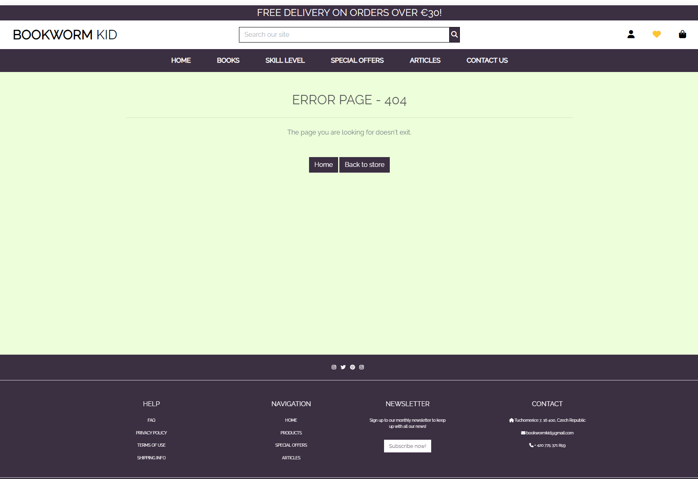

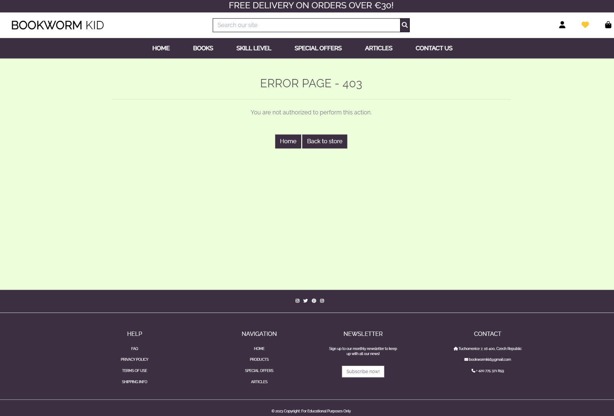

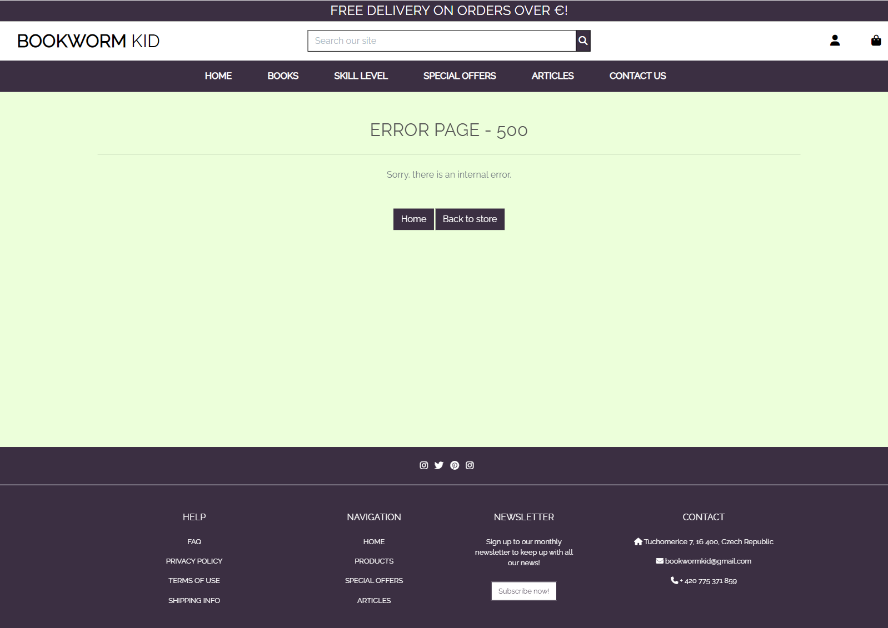


## Future Features

I did not manage to develop all of the features which I wished to use in this project, but in case of some of them, I knew from the beginning they would have to be left for future development.

Here are some of the features I wish to implement in the future:
- Social Account Sign up
- Exchange an old book for store credit - this would be a very cool feature to implement, to help with sustainability and to protect the environment, aleternatively send a discout code for returned used books
- This store could offer stationary and related back-to-school products
- Montesorri toys and materials to help children improve their reading skills through play could complement the offer
- Books should have more attributes - hardcover/paperback, publisher, genre

# Technologies Used
## Languages

- [Python](https://www.python.org/) - Used for adding functionality to the application.
- [HTML5](https://en.wikipedia.org/wiki/HTML) - Provides the content and structure for the website.
- [CSS3](https://en.wikipedia.org/wiki/CSS) - Provides the styling for the website.
- [JavaScript](https://en.wikipedia.org/wiki/JavaScript) - Provides interactive elements of the website

## Frameworks and Software

- [Bootstrap](https://getbootstrap.com/) - A CSS framework that helps building solid, responsive, mobile-first sites.
- [Django](https://www.djangoproject.com/) - An MVT framework used to create the Tennis Buddies site.
- [Figma](https://figma.com) - Used to create wireframes.
- [Github](https://github.com/) - Used for hosting the repository.
- [Projects in GitHub](https://github.com/lucia2007?tab=projects) - Used for project managament.
- [Heroku](https://heroku.com/) - Used for deploying the application.
- [Gitpod](https://www.gitpod.io/#get-started) - Used for developing the application.
- [Markdown Table Generator](https://www.tablesgenerator.com/markdown_tables) - Used to generate tables in Markdown.
- [Favicon Converter](https://favicon.io/favicon-converter/) - used to create a favicon in correct format.
- [Lighthouse](https://developer.chrome.com/docs/lighthouse/overview/) - Used to test performance of site.
- [Responsive Design Checker](https://www.responsivedesignchecker.com/) - Used for responsiveness check.
- [Google Chrome DevTools](https://developer.chrome.com/docs/devtools/) - Used for debugginf and responsiveness testing.
- [HTML Validation](https://validator.w3.org/) - Used to validate HTML code
- [CSS Validation](https://jigsaw.w3.org/css-validator/) - Used to validate CSS code
- [CI Python Linter](https://pep8ci.herokuapp.com/#) - Used for validation python code.
- [Lucid Charts](https://lucidchart.com/) - for creating my ERD Diagram
- [AWS]
- [Stripe]

[Back to top](#contents)

# Python Packages

Following packages and libraries were installed and are located in requirements.txt.
- asgiref==3.7.2
- boto3==1.28.54
- botocore==1.31.54
- dj-database-url==0.5.0
- Django==3.2.21
- django-allauth==0.41.0
- django-countries==7.2.1
- django-crispy-forms==1.14.0
- django-richtextfield==1.6.1
- django-storages==1.14
- django-stubs==4.2.4
- django-stubs-ext==4.2.2
- django-summernote==0.8.20.0
- gunicorn==21.2.0
- jmespath==1.0.1
- oauthlib==3.2.2
- Pillow==10.0.0
- psycopg2==2.9.7
- python-dateutil==2.8.2
- python-slugify==8.0.1
- python3-openid==3.2.0
- requests-oauthlib==1.3.1
- s3transfer==0.6.2
- sqlparse==0.4.4
- stripe==6.5.0
- text-unidecode==1.3
- types-dj-database-url==1.3.0.4
- types-pytz==2023.3.0.1
- types-PyYAML==6.0.12.11
- types-stripe==3.5.2.14
- urllib3==1.26.16

[Back to top](#contents)
# Testing

To test the aspects of the application, I used manual testing and external validators. Both manual and external testing are a part of a separate [testing file](/TESTING.md).

### Manual testing

  - I used manual testing throughout the whole development phase of the project. Mainly:
    - I deployed early to avoid any last minute issues and checked my local and life site periodically. With the live site, I could check responsivness from early on on different devices.
    - I continuously attended to any errors which I came across during the development process.
    - I used validators to check my HTML, CSS and backend code.
    - For each of the user stories I wrote down clear acceptance criteria and tasks which had to be done to meet those criteria. Only after I had met all the conditions, did I move the user story to done.

### External Testing

  All external testing is a part of a separate [testing file](/TESTING.md).

### Automated Testing

I had not managed to do automated testing for this application, but I plan to make it a regular part of my development process in my future projects.

[Back to top](#contents)

# Project Deployment

It is advisable to do an early deployment of the application to be able to regularly check both the local and the deployed versions of the project. Testing of responsivness on different devices is easy with the deployed version. (I could share the link for the deployed app with my friends and receive early feedback.) I found that sometimes it took up to several hours for changes to show in the deployed version, so an early deployment is definitely advantageous to avoid last minute scares.

Follow the steps below to deploy your project:
## Create a new GitHub Repository from CI template

- Navigate to [GitHub](https://github.com) and create a GitHub repository from the [Code Institute template](https://github.com/Code-Institute-Org/gitpod-full-template) by following the link and then click 'Use this template'.

<details><summary><b>Create GitHub Repository</b></summary>

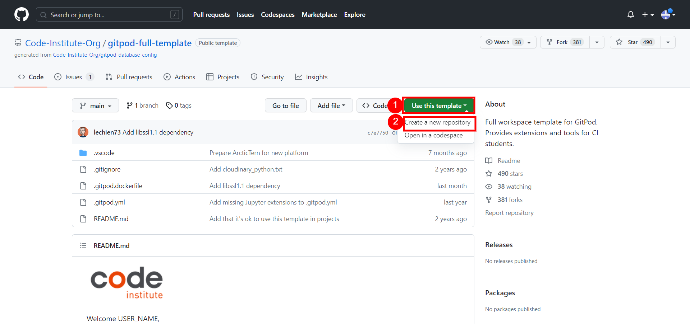
</details><br>

- Fill in the needed details as stated in the screenshot below and then click 'Create Repository From Template'. The name you choose must be unique.

<details><summary><b>Choose Repository Name</b></summary>

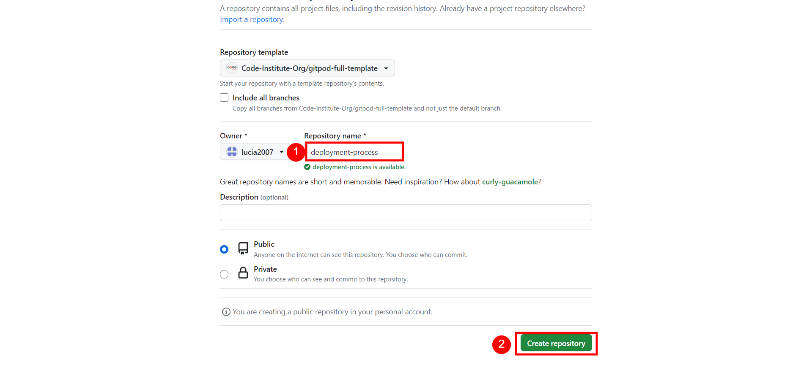
</details><br>

- When the repository is created, click the green 'Gitpod' button as stated in the screenshot below.

<details><summary><b>Click Green GitPod Button</b></summary>

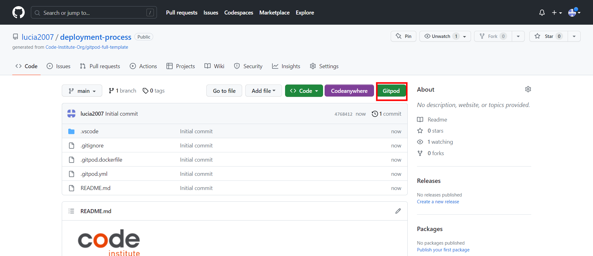
</details><br>

[Back to top](#contents)
## Install Django and the supporting libraries

- To install Django and the supporting libraries, type the commands below.

* ```pip3 install 'django<4' gunicorn```
* ```pip3 install dj_database_url psycopg2```

<details><summary><b>Install Supporting Libraries</b></summary>

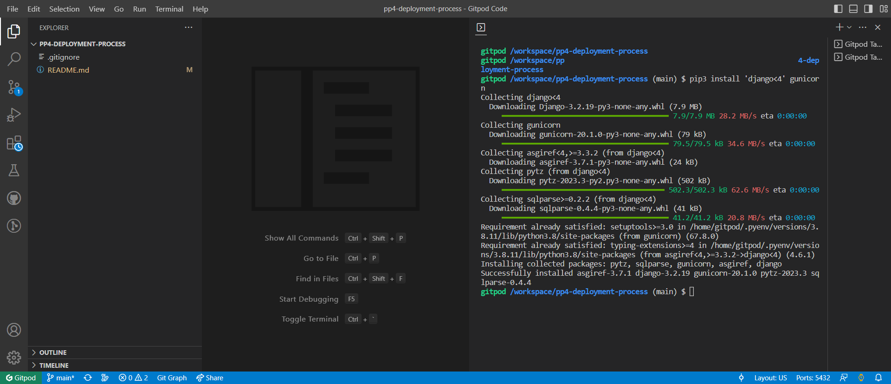
</details><br>

- When Django and the libraries are installed we need to create a requirements file.

* ```pip3 freeze --local > requirements.txt``` - This will create and add required libraries to requirements.txt

<details><summary><b>Create Requirements File</b></summary>

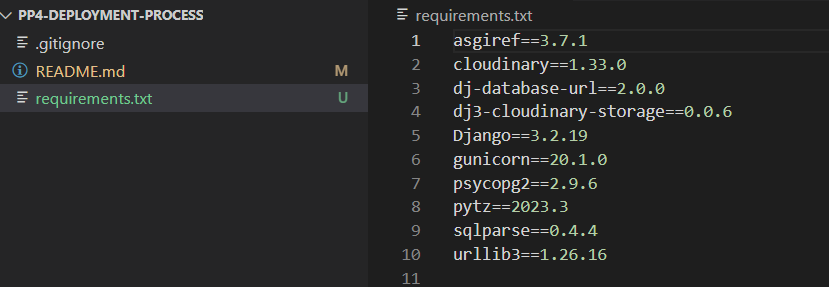
</details><br>

- Create the project.

* ```django-admin startproject YOUR_PROJECT_NAME .``` - This will create your project

<details><summary><b>Create Project</b></summary>

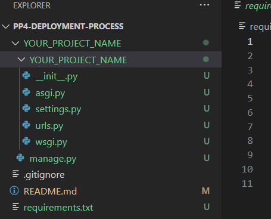
</details><br>

- When the project is created, we can now create the application.

* ```django-admin startapp APP_NAME``` - This will create your application

<details><summary><b>Create Application</b></summary>

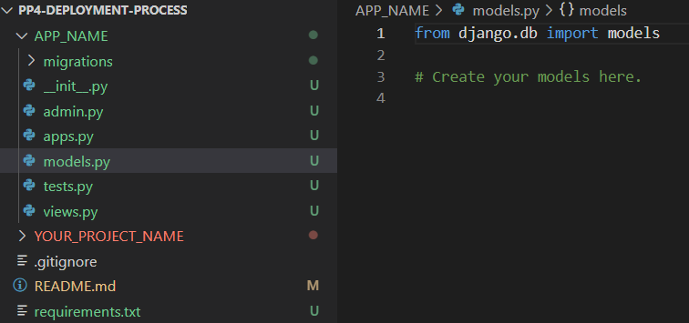
</details><br>

- To create a superuser type in the following code:
`python3 manage.py createsuperuser`

You will be asked to enter credentials after which the superuser is created.  

- We now need to add the application to settings.py

<details><summary><b>Add Application to settings.py</b></summary>

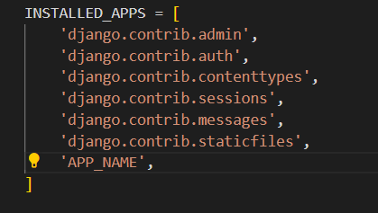
</details><br>

- Now do your first migration and run the server to test that everything works as expected. This is done by writing the commands below.

* ```python3 manage.py migrate``` - This will migrate the changes.
* ```python3 manage.py runserver``` - This runs the server. To test it, click the 'open browser' button that will be visible after the command is run.

- Create `env.py` file at the root level and include the following environment variables. Don't forget to add the `env.py` file in the `.gitignore` in order to keep your secret information from becoming unsafe:

`import os`

`os.environ["DATABASE_URL"] = "insert your own ElephantSQL database URL here"`

`os.environ["SECRET_KEY"] = "this can be any random secret key"`


- In the `settings.py` add the following code under `from pathlib import Path`:

`import os`

`import dj_database_url`

`if os.path.isfile("env.py"):`

`import env`

* Replace the original unsafe SECRET_KEY with the following code:

`SECRET_KEY = os.environ.get('SECRET_KEY')`

* Set `DEBUG = "DEVELOPMENT" in os.environ`. This allows us to have DEBUG set to True when developing locally, but set to False when deployed to Heroku.

* Replace the original `DATABASES` code with the following lines (this allows us to use the postgress database instead of the sqlite3 databases):

`
DATABASES = {
    'default': dj_database_url.parse(os.environ.get("DATABASE_URL"))
  }
`

* Link the file to the Heroku templates directory:
- Under ``BASE_DIR`` enter ``TEMPLATES_DIR = os.path.join(BASE_DIR, ‘templates’)``
- Update ``TEMPLATES = 'DIRS': [TEMPLATES_DIR]`` with:

```
os.path.join(BASE_DIR, 'templates'),
os.path.join(BASE_DIR, 'templates', 'allauth')
```

* Create the following folders at the top level directory:
  * media
  * static
  * templates
  
* Create a file called **Procfile** and add the following line in it:
`web: gunicorn PROJ_NAME.wsgi`

* Make necessary migrations.

* Save all the files and do the first commit and push to GitHub:
  * `git add .`
  * `git commit -m "Deployment Commit"`
  * `git push`

[Back to top](#contents)
## ElephantSQL Database

[ElephantSQL](https://www.elephantsql.com/) is used for the PostgreSQL database in this project.

To create your own PostgreSQL database, sign-up with your GitHub account and follow these steps:
- Click **Create New Instance** to initiate a new database.
- Choose a name, usually the name of the project.
- Select **Tiny Turtle(Free)** plan.
- Leave the **Tags** blank.
- Select **Region** and **Data Center** closest to you.
- Afterwards, click on the new database name, where you can view the db URL and Password. Copy the URL and enter the address into your **config vars in Heroku** and into your `env.py` file.

[Back to top](#contents)
## Heroku Deployment

The project was deployed to [Heroku](https://www.heroku.com). To deploy, please follow the process below:

Create the application on Heroku, attach a database, prepare the `env.py` and `settings.py` file and setup the **AWS storage** for static and media files. 

* Go to [Heroku](https://www.heroku.com/) and sign in (or create an account if needed).

* Once signed in, click the button "New" in the top right corner, below the header and choose "Create new app". The name you choose must be unique. Choose a region which is closest to you.

<details><summary><b>Create New App</b></summary>

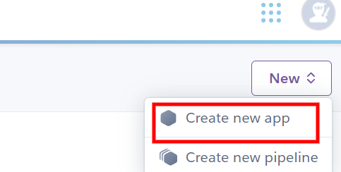
</details><br>

<details><summary><b>Choose Name and Region</b></summary>

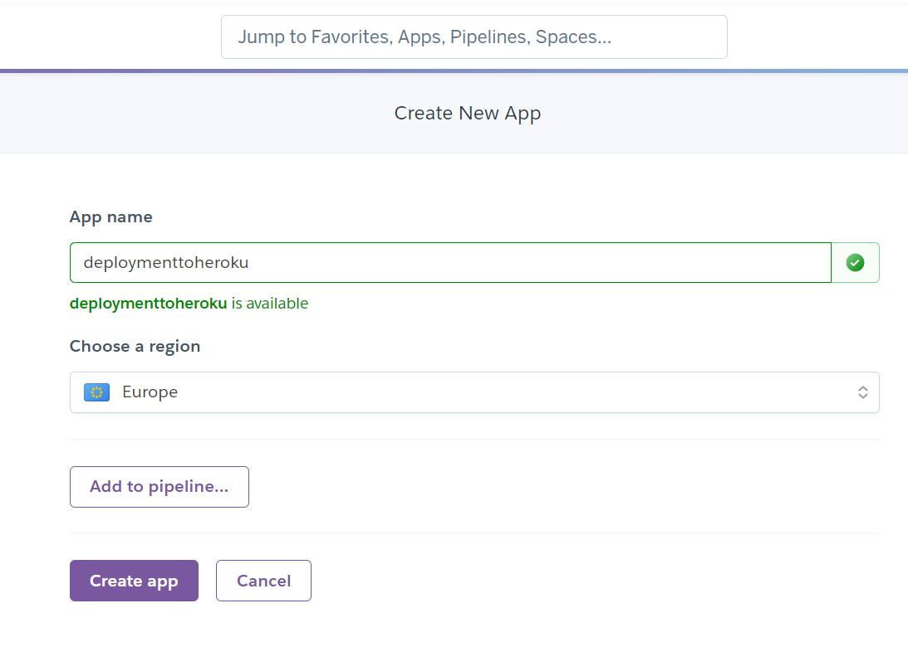
</details><br>

- This brings you to the "Deploy" tab. From here, click the "Settings" tab and scroll down to the "Config Vars" section and click on "Reveal Config Vars". Click the "Add" button on the right and add the following key/value pairs:

   - **DATABASE_URL**:**postgres://...**
   - **DISABLE_COLLECTSTATIC** of value '1'
   - **SECRET_KEY** and value  
   - **AWS_ACCESS_KEY** and value
   - **AWS_SECRET_ACCESS_KEY** and value
   - **EMAIL_HOST_PASS** and value
   - **EMAIL_HOST_USER** and value
   - **STRIPE_PUBLIC_KEY** and value
   - **STRIPE_SECRET_KEY** and value
   - **STRIPE_WH_SECRET** and value
   - **USE_AWS** and value

- `DISABLE_COLLECTSTATIC` variable is needed only for the initial deployment, later this variable must be removed.

Heroku needs two additional files in order to deploy properly (see above):
- `requirements.txt`
- `Procfile` 

- Scroll back to the top of the page and choose the "Deploy" tab. Then choose "GitHub" as Deployment method.
   
<details><summary><b>Deployment method</b></summary>

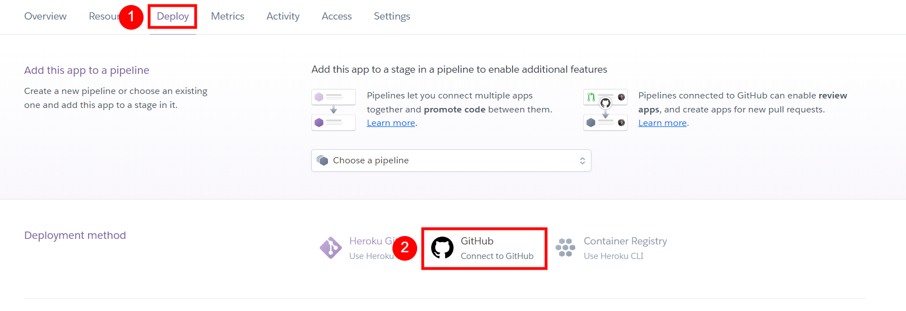
</details><br>

Go to "Connect to GiHub" section, search for the repository name and then click "Connect".
   
<details><summary><b>Connect to GitHub</b></summary>

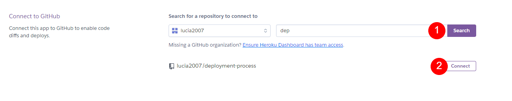
</details><br>

- In the "Automatic Deploys" section, choose your preferred method for deployment. At first, I used the manual deployment option, and later I changed it to automatic deploys. Afterwards, click "Deploy Branch".
   
<details><summary><b>Automatic Deploys</b></summary>

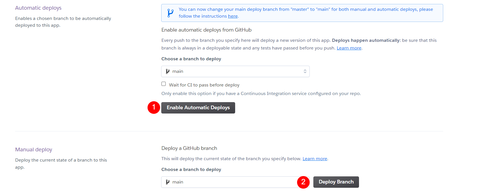
</details><br>

Alternatively, you can follow these steps:
- In the Terminal/CLI connect to Heroku by typing in: `heroku login -i`
- Set the remote for Heroku: `heroku git: remote -a app_name` (replace app_name with your app name)
- After doing Git `add`, `commit`, `push` to GitHub, you can type in: `git push heroku main`

The project should now be deployed to Heroku.

The link to the the live site can be found here - https://bookwormkid-c20568b2004e.herokuapp.com/.
The link to the GitHub repository can be found here - https://github.com/lucia2007/bookwormkid.

Add the Heroku host name into **ALLOWED_HOSTS** in your projects **settings.py file** -> ```['herokuappname', ‘localhost’, ‘8000 port url’].```

**DISABLE_COLLECTSTATIC**  may be removed from the Config Vars once you have saved and pushed an image within your project.

## Google Mail Setup

To be able to receive emails upon registration, checkout and from the contact form, you need to set up app password in your Gmail.

- Setup a Gmail account that will be used to hold and store the emails for your project.
- Log in, navigate to **Settings** -> **Other Google Account Settings** -> **Accounts** -> **Import** -> **Other Account Settings**
- Activate 2-Step Verification
- Once verified access **App Passwords** -> **Other** -> enter a name for the password, eg Bookworm Kid.
- Click **Create** -> copy the 16 digit password that is generated.
- In your `settings.py` add the following Email Settings:
   [Django email settings](./readme_images/../readme-images/email_settings.png)  
- Add EMAIL_HOST_PASS, EMAIL_HOST_USER variable, password and email address to your Heroku Config Vars

## AWS Config

[AWS](https://aws.amazon.com) is used to store the media and static files online for Bookworm Kid. To set it up for your project, please follow the steps below:

- Setup AWS Account and Login
- Create a new S3 Bucket -> name it to match your Heroku App name -> Choose the region closest to you.
- Allow **Click All Public Access**, tick 'Bucket will be public' in order for the bucket to connect to Heroku. 
- In **Object Ownership** -> **ACLS Enabled** -> **Bucket Owner Preferred**.
- **Properties** tab -> turn on static web hosting and add 'index.html' and 'error.html' into the correct fields -> click **Save**
- In the **Permissions** tab, paste in the following CORS config:

   ```
	[
		{
			"AllowedHeaders": [
				"Authorization"
			],
			"AllowedMethods": [
				"GET"
			],
			"AllowedOrigins": [
				"*"
			],
			"ExposeHeaders": []
		}
	]
	```
- Copy your **ARN** string.
- From the **Bucket Policy** tab, select the **Policy Generator** link, and use the following steps:
	- Policy Type: **S3 Bucket Policy**
	- Effect: **Allow**
	- Principal: `*`
	- Actions: **GetObject**
	- Amazon Resource Name (ARN): **paste-your-ARN-here**
	- Click **Add Statement**
	- Click **Generate Policy**
	- Copy the entire Policy, and paste it into the **Bucket Policy Editor**

		```shell
		{
			"Id": "Policy1234567890",
			"Version": "2012-10-17",
			"Statement": [
				{
					"Sid": "Stmt1234567890",
					"Action": [
						"s3:GetObject"
					],
					"Effect": "Allow",
					"Resource": "arn:aws:s3:::bucket-name/*"
					"Principal": "*",
				}
			]
		}
		```
    - Before you click "Save", add `/*` to the end of the Resource key in the Bucket Policy Editor (like above).
	- Click **Save**.
- In the **ACL - Access Control List** -> **Edit** -> enable **List** for **Everyone(Public Access)** -> Accept the warning.

### AWS - IAM setup

- In AWS Services Menu click **Create New Group**, add name eg. 'group-project-name'.
- Navigate to **Review Policy** page -> **User Groups** -> Select newly named group.
- Navigate to **Permissions** tab -> **Add Permissions** -> Click **Attach Policies**
- Select policy -> **Add Permissions** at the bottom, click when finished.
- From **JSON** tab -> select **Import Managed Policy** link -> search for **S3** -> select **Amazon3FullAccess** policy -> **Import**.
- Copy **ARN** from S3 Bucket again ->

   ```
		{
			"Version": "2012-10-17",
			"Statement": [
				{
					"Effect": "Allow",
					"Action": "s3:*",
					"Resource": [
						"arn:aws:s3:::bucket-name",
						"arn:aws:s3:::bucket-name/*"
					]
				}
			]
		}
	```
- Click **Review Policy** -> name eg. 'Bookworm Kid Policy' -> enter a description -> **Create Policy**
- Search for your new policy and click on it to **Attach Policy**
- **User Groups** -> **Add User** -> name eg. 'Bookworm Kid user'
- For **Select AWS Access Type** -> select **Programmatic Access** -> Add group to 'Bookworm Kid user' -> **Review User** -> **Create User**.
- Find **Download.csv** button to download crendetials and save a copy. The file can be downloaded only once, so make sure to save it securely.
  - This file contains the user's **Access key ID** and **Secret access key**.
	- `AWS_ACCESS_KEY_ID` = **Access key ID**
	- `AWS_SECRET_ACCESS_KEY` = **Secret access key** 
- Add these variables into your env.py and Heroku config vars.
### Media Folder Setup
1. In Heroku Config Vars, remove `DISABLE_COLLECTSTATIC` (after at least one image has been added).
2. In AWS S3 create a new folder -> **media** -> Add project images -> **Manage Public Permissions** -> **Grant public read access to the objects** -> **Upload**

### Django AWS Connect

- Install following packages to use AWS S3 Buckets in Django:
   - `pip3 install boto3`
   - `pip3 install django-storages`
- 
- Add the following code in settings.py:
   ```
   INSTALLED_APPS = [
       'storages',
   ]

- Check if AWS variables are present in env.py and if environment variable paths are set in settings.py:
   ```
   import os
   from pathlib import Path
   import dj_database_url

   if os.path.isfile('env.py'):
   import env
   ```

- Check if DATABASES are set up to connect with Heroku Postgres server in production vs SQLite3 when in local development.
   ```
   if "DATABASE_URL" in os.environ:
	DATABASES = {
		"default": dj_database_url.parse(os.environ.get("DATABASE_URL"))
	}
    else:
	DATABASES = {
		"default": {
			"ENGINE": "django.db.backends.sqlite3",
			"NAME": os.path.join(BASE_DIR, "db.sqlite3"),
		}
	}
    ```

- Set up media and static file storage in settings.py:
   ```
   STATIC_URL = "/static/"
   STATICFILES_DIRS = (os.path.join(BASE_DIR, "static"),)

   MEDIA_URL = "/media/"
   MEDIA_ROOT = os.path.join(BASE_DIR, "media")
   ```

- Set up S3 Bucket config in settings.py:
   ```
   if 'USE_AWS' in os.environ:
    # Cache control
    AWS_S3_OBJECT_PARAMETERS = {
        'Expires': 'Thu, 31 Dec 2099 20:00:00 GMT',
        'CacheControl': 'max-age=94608000',
    }

    # Bucket Config
    AWS_STORAGE_BUCKET_NAME = 'Bookworm Kid-096aafe5d13c'
    AWS_S3_REGION_NAME = 'eu-west-1'
    AWS_ACCESS_KEY_ID = os.environ.get('AWS_ACCESS_KEY_ID')
    AWS_SECRET_ACCESS_KEY = os.environ.get('AWS_SECRET_ACCESS_KEY')
    AWS_S3_CUSTOM_DOMAIN = f'{AWS_STORAGE_BUCKET_NAME}.s3.amazonaws.com'

    # Static and media files
    STATICFILES_STORAGE = 'custom_storages.StaticStorage'
    STATICFILES_LOCATION = 'static'
    DEFAULT_FILE_STORAGE = 'custom_storages.MediaStorage'
    MEDIAFILES_LOCATION = 'media'

    # Override static and media URLs in production
    STATIC_URL = f'https://{AWS_S3_CUSTOM_DOMAIN}/{STATICFILES_LOCATION}/'
    MEDIA_URL = f'https://{AWS_S3_CUSTOM_DOMAIN}/{MEDIAFILES_LOCATION}/'
    ```

- Create a 'custom_storages.py' file in the root directory and add the following:
   ```
  from django.conf import settings
  from storages.backends.s3boto3 import S3Boto3Storage

  class StaticStorage(S3Boto3Storage):
  	location = settings.STATICFILES_LOCATION
 
  class MediaStorage(S3Boto3Storage):
	  location = settings.MEDIAFILES_LOCATION
    ```

- AWS S3 Bucket is now connected.

## Stripe Config

Stripe's API is used to handle Bookworm Kid's payment system. To setup follow the below steps:

- Create a Stripe account and log in.
- In the Stripe Dashboard -> **Get your test API keys.**
- Add your `STRIPE_PUBLIC_KEY` and `STRIPE_SECRET_KEY` to your env.py, connect to your settings.py using your environment variables and then enter them into your project's Heroku Config Vars.
- Include Stripe's Webhooks to create an intennt if a customer exits the page during payment authorisation. In Stripe's Dashboard -> **Developers** -> **Webhooks** -> **Add Endpoint**: 'herokuapp url/checkout/wh'
- Choose **Retrieve all events** -> **Add Endpoint**.
- Add new key **STRIPE_WH_SECRET** to env.py, settings.py and Heroku Config Vars as before.

[Back to top](#contents)
## To fork the repository on GitHub

A copy of the GitHub Repository can be made by forking the GitHub account. This copy can be viewed and changed without affecting the original repository. Take the following steps to fork the repository:

1. Log in to **GitHub** and locate the [repository](hhttps://github.com/lucia2007/bookwormkid).
2. On the top right hand side of the page is a button called **'Fork'**. Click on the button to create a copy of the original repository in your GitHub Account.

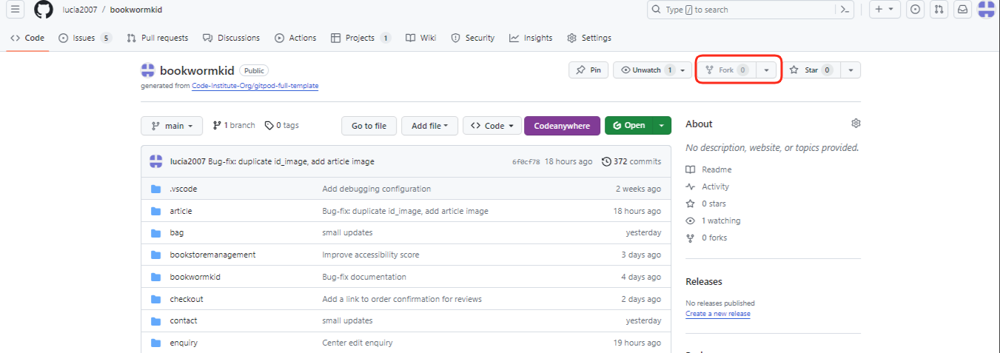

[Back to top](#contents)

## To create a local clone of a project

Take the following steps to create a clone of a project:

1. Click on the **Code** button in the left top corner.
2. Next to the green **GitPod** button, click on **Code** drop-down menu.
3. In the **HTTPS** section, click on the clipboard icon to copy the displayed URL.
4. In your IDE of choice, open **Git Bash**.
5. Change the current working directory to the location where you want the cloned directory to be made.
6. Type `git clone``, and then paste the URL copied from GitHub.
7. Press **enter** and the local clone will be created.
8. Install requirements to get the project to work by typing in this command:
   `pip3 install -r requirements.txt`
   This command downloads and installs all the required dependencies as found in `requirements.txt file`.
9. Set up environment file (`env.py`) so that the project knows what variables are needed to make it work. For retrieving the AWS/Stripe API key and the ElepahtnSQL url, please follow the steps in the relevant sections. 
10. These variables are hidden due to sensitivity of the information. You must not push the `env.py` file to GitHub. You will achieve this by adding the `env.py` to the `.gitignore-file`. The variables that are declared in the `env.py` also need to be added to the **Heroku config vars** apart from the ["DEVELOPMENT"] variable, for detailes see above. (For setting up your AWS and ElephantSQL please follow the steps detailed in the deployment section.)

11.  Make all the relevant migrations before running the server by:
    - `python3 manage.py migrate` - this makes the necessary migrations
    - `python3 manage.py runserver` - enables the project to live locally 
    - `python3 manage.py createsuperuser` - this creates a superuser after you provide credentials

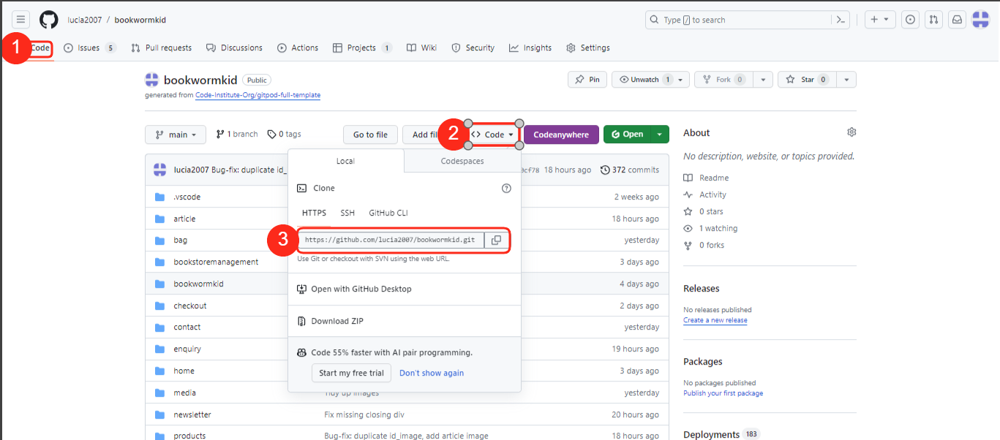

[Back to top](#contents)


# Credits

## Content
- [Triangle snippets from CSS-tricks.com](https://css-tricks.com/snippets/css/css-triangle/)
- [Scott's commit for avoiding decrement disable bug](https://github.com/Code-Institute-Solutions/boutique_ado_v1/commit/de7ad2067ac1b5de37a4cd8b9f4ddf572a4bf6c7)
- [500.html error view](https://github.com/davidcalikes/sensical.ie/blob/main/sensical/urls.py)
- [RichTextField settings - Daisy's Recipe Tutorial](https://www.youtube.com/watch?v=_GNvmwvvS70)
- [Boutique Ado](https://learn.codeinstitute.net/courses/course-v1:CodeInstitute+EA101+2021_T1/courseware/eb05f06e62c64ac89823cc956fcd8191/3adff2bf4a78469db72c5330b1afa836/) for general quidance and mainly for the shopping bag and checkout functionalities
- [I think therefore I Blog](https://learn.codeinstitute.net/courses/course-v1:CodeInstitute+FST101+2021_T1/courseware/b31493372e764469823578613d11036b/fe4299adcd6743328183aab4e7ec5d13/) for articles functionality
- [Bookworm Kid](https://github.com/amylour/Bookworm Kid/tree/main) for articles and wishlist functionalities
- [I Think, Thereforw I Blog Child first](https://learn.codeinstitute.net/courses/course-v1:CodeInstitute+FST101+2021_T1/courseware/b31493372e764469823578613d11036b/dabfed30d1fc4d078b6de270117dbe50/?child=first)
- [Contact Form](https://ordinarycoders.com/blog/article/build-a-django-contact-form-with-email-backend)
- [Read more/Read less buttons](https://codepen.io/joserick/pen/ooVPwR)
- [Property decorator Django - final_price functionality ](https://www.andreadiotallevi.com/blog/how-to-use-the-property-decorator-in-python-and-django)
- [Inspiration for final_price functionality](https://github.com/Iris-Smok/JoyfulBookstore-PP5/blob/main/books/views.py)
- [Privacy Policy and Terms of Use by Termly](https://termly.io/products/terms-and-conditions-generator/)
- [Sticky Footer](https://mdbootstrap.com/docs/standard/navigation/footer/)
- [Top tips for engaging reluctant readers](https://www.explorelearning.co.uk/free-resources/tips-engaging-reluctant-readers/)
- [7 effective ways to increase your child's reading skills](https://www.petitjourney.com.au/7-effective-ways-to-increase-your-childs-reading-skills/)
- [Why Reading is Important](https://www.worksheetcloud.com/blog/why-is-reading-important/)
- [safe filter](https://www.djangotemplatetagsandfilters.com/filters/safe/)
- Book descriptions and book details were taken from [Amazon](https://amazon.co.uk)
- When testing my forms, I was made aware of the possibility of using negative numbers in my add product forms, so I added a minvaluevalidator (inspiration came from here)(https://github.com/worldofmarcus/project-portfolio-5/blob/main/products/models.py).

## Tools
- [Coloors](https://coolors.co/) for finding a suitable color palette.
- [Resize images](https://www.iloveimg.com/resize-image)
- [Convert images jpg to webp](https://convertio.co/jpg-webp/)
- [tinypng](https://tinypng.com/) and [i love img](https://www.iloveimg.com/) for reducing image size
- I used [AI Image Sharpener](https://vanceai.com/sharpen-ai/) to make the hero image sharper.
- [Lucid Charts](https://lucidchart.com/)


[Back to top](#contents)
## Media
- Images were taken from [Unsplash](unsplash.com), [Amazon](amazon.co.uk) and [Megaknihy](megaknihy.cz)
- [A reading girl mural by Jef Aerosol](https://toppng.com/show_download/451527/graffiti-child-reading-book-street-art/xlarge)
- [Overlay over the Hero image](https://stackoverflow.com/questions/28121731/use-pseudo-element-to-create-background-overlay)
- [Favicon](https://cz.pinterest.com/pin/462181980485395733/)
- [Little House](https://www.google.cz/books/edition/Little_House_on_the_Prairie/m06dCwAAQBAJ?hl=en&gbpv=1)
- [Dr. Seuss](https://www.amazon.com/Seusss-Beginner-Collection-Green-Socks/dp/0375851569)

[Back to top](#contents)
## Acknowledgements
- Extra help and guidance was received from my mentor Precious Ijege, from my husband Sam and fellow colleagues and tutors from the Code Institute. Thank you Amy and Iris for sticking with me till the end. Thank you, Precious and Sam, for knowing exactly when to push me harder to add another cool feature or tackle another obstacle.

Thank you all for your support and encouragement. I couldn't have done it without you.

[Back to top](#contents)
