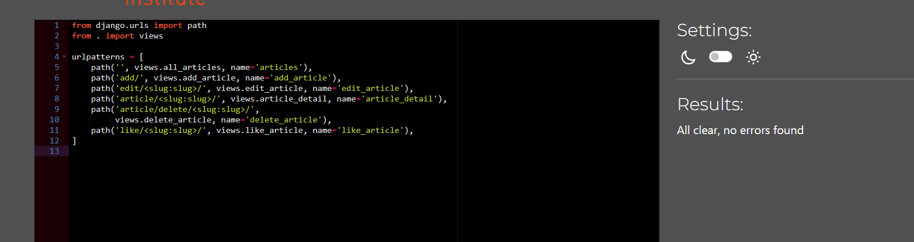

# Testing
- [Testing](#testing)
  - [Code Validation](#code-validation)
    - [HTML Testing](#html-testing)
    - [Python Testing](#python-testing)
    - [JavaScript Validation](#javascript-validation)
    - [CSS Testing](#css-testing)
  - [Browser Compatibility](#browser-compatibility)
  - [Responsiveness Test](#responsiveness-test)
  - [Fixed Bugs](#fixed-bugs)
  - [Unfixed Bugs](#unfixed-bugs)
  - [Additional Testing](#additional-testing)
    - [Lighthouse](#lighthouse)
    - [Results from Lighthouse](#results-from-lighthouse)
    - [User Stories Testing](#user-stories-testing)
    - [Manual Testing](#manual-testing)

## Code Validation

[Back to top](#testing)
### HTML Testing

I used [HTML W3C Validator](https://validator.w3.org) to validate all of my HTML files.

I followed a different approach for validating my HTML for this project as all of my pages contain Jinja syntax such as '' and '{{ form|crispy }}' and most require user authentication to avoid html validation errors. I followed the steps below:

- I gradually opened each html page on my heroku deployed app.
- I right clicked on the screen and chode 'View page source' towards the bottom of the menu.
- I copied the source code.
- I pasted the copied code into the [validate by input](https://validator.w3.org/#validate_by_input) option.
- I checked for errors and warnings, fixed any issues, revalidated by following the above steps and recorded the results.

I would do html validation at different stages of the development to avoid being overwhelmed by multiple errors at the end of the project development.

All HTML pages were validated and received a 'No errors or warning to show' for code that I had written. The image was identical for all pages, so I'm including if here for illustration.


| HTML Source Code/Page | Errors | Warnings |
| ---- | ------ | -------- |
| Home | 0 | 0 |
| All Books (including filtering and sorting) | 0 | 0 |
| Book Detail | 0 | 0 |
| Register | 0 | 0 |
| Log In | 0 | 0 |
| Logout| 0 | 0 |
| Profile | 0 | 0 |
| Admin Dashboard | 0 | 0 |
| Admin Add Product | 0 | 0 |
| Admin Edit Product | 0 | 0 |
| Admin Delete Product | n/a due to deletion modal | n/a |
| Admin Add Article | 0 | 0 |
| Admin Edit Article | 0 | 0 |
| Admin Delete Article | n/a due to deletion modal | n/a |
| Admin Add Enquiry | 0 | 0 |
| Admin Edit Enquiry | 0 | 0 |
| Admin Delete Enquiry | n/a due to deletion modal | n/a |
| Order History | 0 | 0 |
| Wishlist | 0 | 0 |
| Bag - Empty | 0 | 0 |
| Bag - Products | 0 | 0 |
| Checkout | 0 | 0 |
| All Articles | 0 | 0 |
| Article Detail | 0 | 0 |
| Contact Us | 0 | 0 |
| Enquiries | 0 | 0 |
| Newsletter | 0 | 0 |
| Error 403 | 0 | 0 |
| Error 404 | 0 | 0 |
| Error 500 | 0  | 0 |
| Footer | Privacy Policy | [multiple errors](./testing-images/html_privacy_policy_error.png) | x |
| Footer | Terms and Conditions | [multiple errors](./testing-images/html_terms_and_conditions_errors.png) | x |


There were multiple errors in both the Privacy Policy and the Terms and Conditions. Both of these html files were downloaded from termly.io. I didn't attempt to correct the errors as I feared that I would break the document and it would not render correctly. This is perhaps because the service was provided for free. For my future projects, I would look for a better source of these documents.

[Back to top](#testing)

### Python Testing
[CI Python Linter](https://pep8ci.herokuapp.com/#) was used to validate the Python files which were created or edited by me. I regularly checked my code in my environment and corrected mistakes as I went. I shortened the lines where possible, but in a few places I felt splitting the code would make it illegible. In such cases I used `# noqa` to ignore the length of the line.

| Feature | admin | forms | models | urls | views | extra |
|---------|----------|----------|-----------|---------|----------|-------|
| Article | none  | none  | none  | none  | none  | none   |
| Bag | n/a |n/a | n/a | none  | none  | n/a  |
| Bookstore Managegement | n/a |n/a | n/a | none  | none  | n/a  |
| Checkout | none  | none  | none  | none  | none  | none , none , none   |
| Contact | n/a | none  | n/a | none  | none  | n/a  |
| Enquiry |  none  | none  | none  | none  | none  | n/a |
| Home | n/a |n/a | n/a | none  | none  | n/a  |
| Newsletter | n/a |n/a | n/a | none  | none  | n/a  |
| Products | none  | none  | none  | none  | none  | none   |
| Profile |  n/a | none  | none  | none  | none  | n/a |
| Review |  none  | none  | none  | none  | none  | n/a |
| Wishlist | none  | n/a| none  | none  | none  | none   |

[Back to top](#testing)

### JavaScript Validation

[JSHint](https://jshint.com/) was used to validate the JavaScript code added to the project. External JS, for Bootstrap, jQuery and Fontawesome purposes were not validated through JSHint.

| Page | Screenshot | Errors | Warnings |
|---------|----------|----------|-----------|
| Bag - Quantity Update/Remove Script |  | none | none |
| Checkout - Stripe Script |  | none | none |
| Products - Quantity Input Script |  | none  | none |
| Products - Sorting Script |  | none | none |
| Edit Product Image Script |  | none | none |
| Profile - Country Field Script |  | none | none |
| Back to Top Button |  | none | none |

[Back to top](#testing)
### CSS Testing
[W3C CSS Validator](https://jigsaw.w3.org/css-validator/) was used to validate my CSS files. External CSS for Bootstrap, provided by CDN was not tested. No errors were found.

To avoid cluttering my testing file with multiple identical images, I have not included every screenshot of the CSS validations, as they were all the same.


| CSS File | Errors | Warnings |
| ---- | ------ | -------- |
| Base CSS | 0 | 0 |
| bag | 0 | 0 |
| Checkout | 0 | 0 |
| Profiles | 0 | 0 |

[Back to top](#testing)
## Browser Compatibility

The website was tested on the following browsers: Google Chrome, Safari, Microsoft Edge and Mozilla Firefox. There were no errors discovered in the functionality of the site or the individual features.

| App | Browser Compatibility |
| ---- | ---------- |
| Google Chrome | &check; |
| Safari | &check; |
| Microsoft Edge| &check; |
| Mozilla Firefox| &check; |

[Back to top](#testing)

## Responsiveness Test

Achieving responsiveness on this project was much easier and faster than before mainly due to the application of Bootstrap. I always strived to put mobile devices first and then I used medie queries for larger devices, as it is proven that majority of internet users are accessing web apps through their mobile phones.

Testing of responsive design was carried out manually by utilizing [Google Chrome DevTools](https://developer.chrome.com/docs/devtools) and [Responsive Design Checker](https://www.responsivedesignchecker.com/).

|        | S Galaxy 5 | iPhone 6/6S/7 | iPad Mini | iPad Pro | Display <1200px | Display >1200px |
| ------ | ---------- | ------------- | --------- | -------- | --------------- | --------------- |
| Render | pass       | pass          | pass      | pass     | pass            | pass            |
| Images | pass       | pass          | pass      | pass     | pass            | pass            |

[Responsiveness test video](./testing-images/responsivness_test.mp4)


[Back to top](#testing)

## Fixed Bugs

|                                        BUG                                       | WHERE |                                      HOW                                      |                   COMMIT                   |
|:--------------------------------------------------------------------------------:|:-----:|:-----------------------------------------------------------------------------:|:------------------------------------------:|
| The quantity of books in the shopping bag was not updating.| bag.html  | I had to take away the "href" element from the respective buttons.| [b3393b9](https://github.com/lucia2007/bookwormkid/commit/b3393b91866a5edf35f3e44bdd5cc408c3a815cb)  |
| The crispy_forms were not loading correctly | settings.py  | I had to correct a typo.| [af52cfe](https://github.com/lucia2007/bookwormkid/commit/af52cfe5f13c18af0ea7817c1164507551d9b475)  |
| The 404 page was not applying custom template | settings.py  | I had to move content from settings.py to urls.py| [af52cfe](https://github.com/lucia2007/bookwormkid/commit/f60afce6a6725faf30e0ae3b6ba7b95f1e5845df) and [3c048ce](https://github.com/lucia2007/bookwormkid/commit/3c048cebbd26b0f8a9c2ddeec379d0b1976da38c) |
| The 403 and 500 error pages were not applying custom template | views.py, urls.py  | I had made several messy commits trying to see if the error pages worked on the deployed app. In the end I reverted to the simplest option, just define error pages in the templates directory without any views.py or urls.py error code| [ and several previous commits](https://github.com/lucia2007/bookwormkid/commit/307f044cdbea30b665fed8fad6a2702213ab3aa5)
| My user registration and email sending for order confirmation stopped working | settings.py, gmail, heroku  | I'll provide a more detailed explanation below*. | [a960055](https://github.com/lucia2007/bookwormkid/commit/a960055f60ad0a04dc4192ae04a5a7e9c790ee9b) and [965c607](https://github.com/lucia2007/bookwormkid/commit/965c607c8a8115a25ff0d8d199aeccf2f7cf8f40)
| "Country" label was appearing twice in my checkout form | checkout/forms.py  | I had to correct the indentation error. | [1b653a2](https://github.com/lucia2007/bookwormkid/commit/1b653a2269432d69ce9bb975befc7c77253bb056)
| Wishlist items were rendering incorrectly | wishlist.html  | I had several indentation errors and wrong order of elements which I had to fix. | [d34b771](https://github.com/lucia2007/bookwormkid/commit/d34b7719ce77c698882f2e196511dd930ce3bb9c)
| My Wishlist context processor wasn't working due to inconsistencies in the code. | wishlist/contexts.py  | I had to correct the variable names in the file. | [81af4d7](https://github.com/lucia2007/bookwormkid/commit/81af4d793bc781c0e49183faaa7d9b322c0f5788)
| Noimage placeholder picture was not displaying for articles if no image provided. | article/models.py  | I had to get rid of default=placaholder for the image in the model. | [230333b](https://github.com/lucia2007/bookwormkid/commit/230333bfd2a23d9d75752c0d82a983e7785323ad) and [6a935d8](https://github.com/lucia2007/bookwormkid/commit/6a935d8f37bfcfdba8816842b5de491ed9f88f51)
| Adding a draft of an article would take me to a 404 page | article/views.py  | I had to update my views, espcially take away the status=1 condition from my detail views. | [692d357](https://github.com/lucia2007/bookwormkid/commit/692d357d724180422312cac204d2658e11846187)
| Article edit picture was not working - tip from tutor| article/views.py  | I had to add request.files to my view | [9728fc8](https://github.com/lucia2007/bookwormkid/commit/9728fc809f60383ea2b28eca683dde7bd342af25)
| Class "{%" duplicated| products.html| I had change the place where I added the condition for filters** | [dccafb7](https://github.com/lucia2007/bookwormkid/commit/dccafb7b55aec72f89a381019eabd77c4caec305)
| Avoid anonymous user error for reviews  | product_detail.html, products/views.py| I had to switch the order of the conditions | [e9e9b23](https://github.com/lucia2007/bookwormkid/commit/e9e9b23a5b90202e3bc693b736833941e565847a)
| 'AnonymousUser' object is not iterable (max 1 review) and wrong rendering  | products.html, product_detail.html, products/views.py| I had to switch the order of the if conditions and add a @login_required decorator to my view| [59fc46d](https://github.com/lucia2007/bookwormkid/commit/59fc46daea23bf228de2c7288e244c4100fb96c6)
| Div not persmissible under small + extra space in tab= -1  | articles.html, article_detail.html, article_deletion.html | I had to change small to div and add classes, and delete an extra space in tabindex=" -1"| [2754559](https://github.com/lucia2007/bookwormkid/commit/2754559bd3b5a4a9f711a69e0f4a4f13d1dd2d61)
| Fix duplicate id="id_image" (I wasn't able to add an image to an article) | articles.html, add/edit_article.html, products.html, add/edit_product.html, custom_clearable_file_input.html | I had to get rid on id="new-image", as it was creating a duplicate id, and had to add/change js which worked with "new-image"| [6f0cf78](https://github.com/lucia2007/bookwormkid/commit/6f0cf78c2697b1de4f6a7c592ea235dc924ee49b)

 My registration and email confirmation for orders stopped working for all users but admin. This was partly due to the fact, that I attempted to use aws ses functionality for sending emails for my contact form. I later found out that aws ses in the basic version would allow sending emails only to verified email addresses, which couldn't be done when a new user was being created, as his email address was new and not verified. I found out that if I used a "helping email address" success@simulator.amazonses.com, everything worked fine. If I wanted aws ses to send emails to nonverified email address, I would have to ask for a personal approval from Amazon. As it was proving quite complicated, I opted to revert back to the previous smtp functionality. Neverthless, the problem persisted even after that. With tutor support we were able to discover that my "app password" in my gmail account got deleted (without any action on my side) and thus the email functionality stopped working. When I created a new app and reset the password in Heroku, everything started working again. I hope this problem doesn't happen again, as it's completely out of my control if Google decided to delete my "app password" for some reason.
[Error due to deleted app password](/testing-images/smtp_error.png)

** There are quite a few commits around my product filters and highlighting of the chosen age segment, as I was trying to figure out ways how to do it more efficiently and more simply. There was a lot of back and forth, and some unnecessary or duplicated commits, and even though I know the code could still be refactored, I feel that at the moment it is finally easily legible and understandable.

[Back to top](#testing)
## Unfixed Bugs

I noticed the phone number validation was not present on the profile form and the checkout form, so I wanted to add it. It was easy enough to do for the profile form, but I had a hard time making it work for the checkout form. It was easy enough to add the validation itself, but as soon as I used this code and entered an invalid phone number, I would get this [error]. I tried to fix it, I tried different ways of validations, asked for tutor help (two of them got together to help figure it out), but the issue was not in the validation itself but in the way invalid form is handled in Boutique Ado, which was the source for the payment functionality for this project. We concluded that I would have to rewrite quite a bit of code to fix this and I did not feel confident enough to do it at this stage. For now, phone number validation is not present either for profile form or the checkout form. I hope to do this later, when not under a tight deadline.

[Back to top](#testing)

## Additional Testing
### Lighthouse

The application was also tested using [Google Lighthouse](https://developers.google.com/web/tools/lighthouse) in Chrome Developer Tools. The following aspects were tested:

- Performance - reveals how the site performs during loading
- Accessibility - shows if the site if accessible for all users and suggests ways to improve it
- Best Practices - indicates if the site conforms to industry best practices
- SEO - Search Engine Optimisation - shows if the site is optimised for search engine result rankings

### Results from Lighthouse
| Page | Validation Results |
| ---- | ---------- |
| Home | [Home Page Score](./testing-images/lighthouse_homepage.png) |
| Contact Us | [Contact Us Score](./testing-images/lighthouse_contactus.png) |
| Products | [Products Score](./testing-images/lighthouse_products.png) |
| Product Details | [Product Details](./testing-images/lighthouse_product_detail.png) |
| Admin Dashboard | [Admin Dashboard](./testing-images/lighthouse_admin_dashboard.png) |
| Shopping Bag | [Shopping Bag Score](./testing-images/lighthouse_shopping_bag.png) |
| Checkout | [Checkout Score](./testing-images/lighthouse_checkout.png) |
| Articles | [Articles Score](./testing-images/lighthouse_articles.png) |
| Article Details | [Article Details](./testing-images/lighthouse_article_detail.png) |
| Wishlist | [Wishlist Score](./testing-images/lighthouse_wishlist.png) |
| Profile | [Profile Score](./testing-images/lighthouse_profile.png) |
| Enquiries | [Enquiries Score](./testing-images/lighthouse_enquiries.png) |
| Sign In | [Sign In Score](./testing-images/lighthouse_login.png) |
| Sign Up | [Sign Up Score](./testing-images/lighthouse_signup.png) |
| Sign Out | [Sign Out Score](./testing-images/lighthouse_logout.png) |

I continuously worked on improving the individual scores and tried to reflect on the warnings in the Lighthouse which lead to the score increase. For increasing accessibility I had to change many button names as I was not using their explicit description and for performance I used [tinypng.com](https://tinypng.com/) and [convertio](https://convertio.co/) and [i love img](https://www.iloveimg.com/resize-image) to decrease their size and change them to webp where possible. However, I couldn't do this for all of my images, espcially for the book covers, as sometimes I was not able to find a large enough image of a book I needed.

All of my scores for all of the pages were above 90, often close to 100. On a couple of pages the "SEO" score is slightly lower. This is due to the presence of a "back to top" button which has no href value and thus is not crawlable. When I tried to change the anchor element into a button with this code:

```
<div class="btt-button d-flex justify-content-around text-decoration-none">
    <button type="submit" class="btn-link bg-navy w-100 h-100 rounded-circle">
        <i class="fas fa-arrow-up bg-navy text-white mx-auto my-auto"></i>
    </button>
</div>
```

my SEO was raised to a 100, but my accessibility went down because the button couldn't have an accessible name, so I decided to leave it as is.

I also got a lower score on Best Practices, due to [issues](./testing-images/stripe_cookies.png) which were logged into the console and have to do with using stripe cookies. Sometimes my scores for performance differed, probably due to current connection speed.

[Back to top](#testing)
### User Stories Testing

Before any of the user stories were moved into the done column, I checked against all the acceptance criteria and all the tasks to make sure I had not forgotten anything vital. User stories were checked on a regular basis and extensively towards the end of the project.

| User Story                 | Outcome | Pass/Fail |
|----------------------------|---------|-----------|
| US - Navigation | As a **user** I can **locate the navigation area** so that I can **easily access different parts of the website**. | The navigation bar is present at the top of the page. |&#9745; |
| US - Footer | As a **user**, I can **access relevant information about the business, contact information and social media links without having to scroll back to the top of the page** so that I can **learn about terms and conditions, contact the eshop and follow the eshop online**. | Footer is present at the bottom of the page and contains all relevant information. | &#9745; |
| US - User Registration | As a **site user** I can **choose to register on the site and have my own account with personalized information** so that I can **easily review my past activities on the site and smoothly do another purchase**. | It is possible register as a new user, including email confirmation. | &#9745; |
| US - User Login/Logout Functionality | As a **site user** I can **login in and logout of my account** so that I can **access personalized data, special features and keep my online activities safe**. | As a logged in user, I can access My profile info, my wishlist and leave reviews. |&#9745; |
| US - Account Email Validation | As a **site user** I can **register my email and receive a validation link via email** so that I **can create an account to track my spending and purchases**. | User has to confirm their email address by clicking on a link received in their inbox. |&#9745; |
| US - Shopping Bag | As a **customer** I can **choose the quantity of the product and add it to the shopping bag** so that I can **buy the product later**. | The quantity buttons work on shopping bag on both mobile and desktop and do not accept decimal numbers. |&#9745; |
| US - Add Products to Bag | As a **customer** I can **click on Add to Bag button on product detail page** so that I can **add the product and its chosen quantity to the shopping bag**. | Clicking on the "add to bag" button leads to the chosen product being added to the bag. | &#9745; |
| US - Shopping bag icon/functionality avaiable from all books view | As a **user** I can **buy a chosen book directly from the all product view** so that I don't **have to go to product detail page**. | User can click on "add to bag" button on all page view and 1 piece of the chosen book is added to the shopping bag. |&#9745; |
| US - Search Functionality | As a **site user**, I can **enter keywords into the search** bar so that I can **search for a specific item**. | Search functionality works for products, not articles or reviews (future feature). The customer is informed if no items match their query. |&#9745; |
| US - View All Products | As a **customer**, I can **easily scroll through all products** so that I can **see all the products the eshop offers". | Cards with all books and their details are visible on the all books pages. | &#9745; |
| US - Product Detail View | As a **customer** I can **click on an individual product** so that I can **see the title, author, book description, price, segments by age and skill level etc**. | Click on the chosen book card, takes us to the book detail page where all the details are present. | &#9745; |
| US - Checkout | As a **customer** I can **securely checkout the products in my shopping bag** so that I can **finish my purchase**. | Checkout functionality works and results in: order added to the database, order visible in order history, confirmation email is received and webhook success message is present. | &#9745; |
| US - Order Email Confirmation | As a **customer** I can **receive an email after purchase** so that I can **confirm my purchase and keep a record of my order**. | A user receives an email upon order confirmation whether signed in or not. | &#9745; |
| US - Order sorting | As a **user** I can **view my past orders in descending order** so that I can **easily find my most recent orders**. |  Orders from the newest to the oldest are visible in My Profile.| &#9745; |
| US - User Profile | As a **site user** I can **register and create an account** so that I can **save my personal details, see order history and checkout quickly**. | User default delivery information and past orders are available under My profile. | &#9745; |
| US - User Notifications (Toasts) | As a **customer** I can **view messages/toasts which inform me about my actions** so that I can **be sure that a certain action/choice took place**. | Toasts are continuously being displayed upon user actions. | &#9745; |
| US - Filtering according to skill levels, special offers features | As a **customer** I can **sort the products according to reading skill level, according to different special features** so that I can **quickly find the products I'm interested in** | Filtering by skill or specials attributes renders the correct products. | &#9745; |
| US - Product Sorting Functionality | As a **customer** I can **sort the products according to the price, category name and rating** so that I can **see the products sorting according to the chosen criterion**. | Products are sorting according the chosen criterion. Sorting by name was added to the navbar during testing, as it was missing. | &#9745; |
| US - Product Category/Specials Filter | As a **site user** I can **click on the options in the navbar** so that I can **see the chosen categories/subsegments to make my search quicker.** | The links takes the user to the correct subsegments. | &#9745; |
| US - Specials (on sale/featured/new arrival) Visual Confirmation | As a **customer** I can **easily see which products are in the specials category** so that I can **avail of specials deals**.| User can see special icons related to each category on the products cards on both the all products and product detail pages. | &#9745; |
| US - Admin Dashboard | As an **admin** I can **add/edit/remove products to the store offer through admin dashboard** so that I **don't have to do it through the admin panel** | It is possible to add products through the admin dashboard when an admin user is signed in. | &#9745; |
| US - Bookstore Management | A an **admin/superuser** I can access the Bookstore management page** so that I **can add/edit/delete Articles, Enquiries and Products without having to access the django admin**. | A link to the Bookstore Management page is available from the Profile Icon if an admin user is signed in. | &#9745; |
| US - View all articles | As a **user** I can **see all articles** so that I can **choose which one I am most interested in and educate myself on the top of the importance of reading**. | Articles link takes the user to view all articles. | &#9745; |
| US - View Article detail | As a **user** I can **click on the article card** so that I can **read the article and see extra details**. | Clicking on the chosen article card, takes the user to the article detail page. | &#9745; |
| US - Add Articles to the app (add, edit, delete functionality) | As a **user** I can **read several interesting articles about why reading skills are important and how to encourage children to read** so that I can **understand the issue better**. | Articles with meaningful and relenant content are present on the article page.  | &#9745; |
| US - View likes | As a **user** I can **like/unlike an article** so that I can **express my opinion**. | A heart with the number of likes is present both on all articles page and the article details pages. | &#9745; |
| US - View Like/Unlike articles | As a **signed in user** I can **like/unlike articles and be visually informed about my action** so that I can **express my views**. | A signed in user can click on the heart at the bottom of the article detail page and like it or unlike it. The number of likes is subsequently updated. | &#9745; |
| US - Add Read more/Read less functionality | As a **user** I can **choose if I want to read the whole book description** so that I **am not overwhelmed by too much text**. | Read more/read less buttons are present on product detail pages and work correctly. | &#9745; |
| US - Wishlist | As a **customer** I can **add desired products into my wishlist** so that I can **be reminded later which products were interesting for me** | When the user is signed in, they can add products to their wishlist and they are informed if the product had already been added. | &#9745; |
| US - Wishlist icon changes colour when there is an item in the wishlist | As a **customer** I can **distinguish if there is something in my wishlist** so that I can **be informed about my actions**. | The wishlist icon is yellow/orange when at least one book is added, or blue when wishlist is empty. | &#9745; |
| US - Contact | As a **user** I can **contact the store by filling in a form directly on the webpage** so that I **don't have to send an email through a different app**. | A user can fill in a form and gets a toast about successful submission. The store gets an email with the enquiry. During the last week of development, I added a thank you page which displays when the user send the enquiry. | &#9745; |
| US - Frequently asked questions - FAQ | As a **user** I can **easily find answers to frequently asked questions** so that I **don't have to call or write to the store owners to find out the information**. | FAQs are available in the footer in collapsible form and provide answers to FAQs. | &#9745; |
| US - Add age segmentation filtering | As a **customer** I can **easily find books in a chosen age category** so that I **don't have to search all the products**. | Age segmentation works for the chosen age groups. |&#9745; |
| US - Add age segmentation for all product views and filters | As a **user** I can **use age segmentation in combination with category or specials filters** so that I can **easily find an age appropriate book in the chosen subsegment**. | Age segmentation works within the prechosen segments. | &#9745; |
| US - Add double filtering for products according to different segments & age | As a **user** I can **sort the products by age within any chosen subsegment** so that I can **quickly find an age appropriate book**. | Age segmentation is present for all segements, including the specials category. | &#9745; |
| US - Make the chosen age parameter visually clear | As a **user** I can **easily say if an age filter has been applied to the current template** so that I **don't have to study the product list for confirmation**. | When a certain age category is chosen, the user can clearly see which one it is, as the button is changed to dark blue. | &#9745; |
| US - Sales price functionality | As a **user** I can **buy products on sale** so that I can **save money and enjoy my shopping more**. | A customer can clearly see if a product is on sale by seeing the sale icon and the sale price in red. The original price is crossed out. | &#9745; |
| US Sorting according to sales price | As a **user** I can **see the products correctly ordered by their effective price** so that I **can easily identify the cheapest/most expensive products**. | The products sorting works correctly both in descending and ascending directions. | &#9745; |
| US - Add Terms and Conditions, Privacy Policy | As a **user** I can **learn what the company's Terms and Conditions and Privacy Policy are** so that I can **understand my rights and obligations in connection to the store**. | Terms of Use and Privacy Policy are present in the future and can be reviewed by users. | &#9745; |
| US - Newsletter | As a **user** I can **subscribe for a newsletter service** so that I can **be informed about any news, new development on the bookwormkid app**. | A user can enter a valid email address to subscribe for the newsletter. They are informed if they had already signed up. | &#9745; |
| US - Visual confirmation for shopping bag/wishlist items | As a **customer** I can **easily see if there is something in my wishlist or shopping bag** so that I can **be informed about my current and previous actions**. | Wishlist and shopping bag icons change color to orange/yellow when there is at least one product present. | &#9745; |
| DT - Add customized 403, 404, 500 Error pages | As a **developer** I can **display customized error pages** so that they **correspond to the overall site design**. | All error pages work and are displayed on the base template to be consistent with the store design. | &#9745; |
| US - Confirm Deletion | As an **superuser/admin** I can **confirm deletion of products or articles** so that I don't **accidently delete a product or article**. | A deletion modal is displayed whenever an admin user wants to delete a book/article or enquiry. | &#9745; |
| US - Toasts without shopping bag | As a **user/admin** I can **be informed about my actions without the shopping bag showing** so that I can **clearly and easily see the action confirmation and not be overwhelmed by too much unnecessary information**. | Shoppping bag doesn't show when articles and enquiries are handled. | &#9745; |
| US - Optimize footer for small devices | As a **user** I can **click on Help button in footer which contains all relevant links** so that I **don't have to scroll too far**. | Several links are moved under the HELP button for small devices to avoid taking too much space. | &#9745; |
| US - Create Facebook page | As a **user** I can **visit the store's facebook page** so that I can **have access to the newest posts and connect with other followers of the bookstore**. | Facebook page is created and available for the user to see. They are taken there by clicking on the facebook icon in the footer. |&#9745; |
| US - Product Review | As a **user** I can **add a review for a book I had bought previously by clicking on the item in my order history** so that I can **express my opinion**. | A user can add a review for a book they bought, if they had not reviewed the products already. A form to submit the review is present on the book details page for the items the user had bought. This feature is accessible by clicking on a link in the order confirmation or by visiting the product detail page of the product previously bought by the user. | &#9745; |
| US - Lets the user review a book only once | As a **user** I can **review a product only once** so that I can **share my opinion but not spam others**. | The form for book review is unavailable for the signed in user, if they had reviewed the book before. | &#9745; |
| US - Wishlist visual confirmation | As a **user** I can **clearly see that I already have a book in my wishlist** so that I don't **try to add it again**. | When a user adds a book to the wishlist, the "add to wishlist" button changes to "remove from wishlist" button and the heart changes its color to solid. | &#9745; |
| US - There are no past orders/no books found | As a **user** I can **be informed that I entered a wrong key word or that there are no orders in my history** so that I **don't have to guess what went wrong**. | These messages are correctly displayed in situations when no orders or wrong key words were entered. | &#9745; |

[Back to top](#testing)

### Manual Testing

**User Input/Form Validation**

I tested all Bookworm Kid features repeatedly throughout the development process and again at the end in the testing sprints. The final testing was carried out on the deployed version on Chrome on desktop. All features were tested for both guest and logged in user, but to avoid redundancy, I added only the extra features available to the logged in users in the respective section. Again, for the admin section, only new features were mentioned to avoid redundancy.

| Status | **Main Website - User Logged Out - Top Navigation**
|:-------:|:--------|
| &check; | The free shipping treshold corresponds to the value set in the settings.py file.
| &check; | Typing in a incorrect URL on the page loads the 404 error page.
| &check; | Pasting page that needs authentication opens the login page (e.g. clicking on a "add to wishlist" button if not signed in).
| &check; | Pasting page that is restricted to a logged in admin user, displays the login page first and either a forbidden 403 page for articles or a warning message for products. 
| &check; | Inputting an invalid query in the search box displays "Sorry, no books match your search" message.
| &check; | Clicking the Register link in the My Account menu loads the sign up page.
| &check; | Clicking the Login link in the My Account menu loads the login page.
| &check; | Clicking on the shopping bag link in the menu bar loads the shopping bag page.
| &check; | Inputting an empty query in the search box triggers an error messages and lists all products.


| Status | **Main Website - User Logged Out - Main Navigation**
|:-------:|:--------|
| &check; | The main navigation collapses into a hamburger on small screens. All links work properly.
| &check; | Clicking the nav logo loads the home page.
| &check; | Clicking the Home button on the nav bar loads the home page.
| &check; | Clicking the By Price link in the Products menu lists all products and sorts them by price taking the sales price into consideration if a product is on sale.
| &check; | Clicking the By Rating link in the Products menu lists all products and sorts them by rating.
| &check; | Clicking the By Name link in the Products menu lists all products and sorts them by name.
| &check; | Clicking the By Category link in the Products menu lists all products and sorts them by Category name.
| &check; | Clicking the All Products link in the Products menu lists all products.
| &check; | Clicking the Reluctant Reader link in the Categories menu lists all products within the Reluctant Reader category are displayed.
| &check; | Clicking the Keen Reader link in the Categories menu lists all products within the Keen Reader category are displayed.
| &check; | Clicking the Avid Reader link in the Categories menu lists all products within the Avid Reader category are displayed.
| &check; | Clicking the All Products link in the Skill Level menu lists all products.
| &check; | Clicking the New Arrivals link in the Special Offers menu lists all products with the tag new arrivals and displayes the correct icon.
| &check; | Clicking the Featured Books link in the Special Offers menu lists all products with the tag Featured Books and displayes the correct icon.
| &check; | Clicking the On Sale link in the Special Offers menu lists all products with the tag On Sale and displayes the correct icon.
| &check; | Clicking the Specialls link in the Special Offers menu lists all products with the tag New Arrival/Featured or On Sale and displayes the correct icons.
| &check; | Clicking the Articles link takes the user to all articles page, 4 articles are displayed.
| &check; | Clicking the Contact US link takes the user to a contact form which the user can fill in.


| Status | **Main Website - User Logged Out - Books**
|:-------:|:--------|
| &check; | Clicking the filtering links in the by skill or special offers, renders the correct subcategory name at the top of the page.
| &check; | Age segmentation buttons + all are present on all product pages.
| &check; | Clicking the chosen age link (6-8, 9-10, 11-12, all) displays products within that age group in the chosen subcategory (e.g. skill level or specials) and the correct age button choice is highlighted in dard blue.
| &check; | Sorting function below the product page headline sorts the products accordingly within the chosen subsegments.
| &check; | The correct image and information for each book is displayed.
| &check; | One piece of the chosen book is added to the shopping bag when "add to bag" button is clicked from the main products page.
| &check; | If product is added to bag successfully, a toast with bag and delivery cost information is displayed in the top right corner, if total price is below €30 or without it delivery fee, if the total price is higher. The toast includes a link to the shopping bag.
| &check; | When the first products is added to the bag, the bag changes color to yellow.
| &check; | Clicking the "add to wishlist" button takes the user to the login page.
| &check; | Sales price is displayed in red if present.
| &check; | Products have correct specials icons if in new arrivals/featured or on sale.
| &check; | Back to top button is present in the right hand corner and takes the user to the top of the page.

| Status | **Main Website - User Logged Out - Books Details**
|:-------:|:--------|
| &check; | Clicking the book image on the product card, loads the product detail page.
| &check; | Clicking the book image on the product detail page displays a new page with the book image.
| &check; | Book details (title, author, category, age group, price, rating, description, quantity selection, keep shopping/add to bag buttons and a clickable number of reviews if present are displayed. If book is in specials category, a correct icon is present and all add to wishlist button.)
| &check; | Sales price is displayed in red if present.
| &check; | Clicking the read more button opens up the whole book description.
| &check; | Clicking the read less button closes the whole book description.
| &check; | Setting the quantity in the quantity selector and clicking "add to bag" button, adds the correct quantity in the bag (works for both mobile and larger screens).
| &check; | Trying a add a decimal number in the quantity selector renders a warning message about using whole numbers.
| &check; | If product is added to bag successfully, a toast with bag and delivery cost information is displayed in the top right corner, if total price is below €30 or without it delivery fee, if the total price is higher. The toast includes a link to the shopping bag.
| &check; | When the first products is added to the bag, the bag changes color to yellow.
| &check; | Keep shopping button takes the user back to all books.
| &check; | Clicking the "add to wishlist" button takes the user to the login page.
| &check; | If reviews are present, the reviews icon and their number is displayed. The user can click on the reviews button and see all the current reviews.

| Status | **Main Website - User Logged Out - Articles**
|:-------:|:--------|
| &check; | Clicking the article link, takes the user to all articles.
| &check; | The correct image and information for each article post is displayed.
| &check; | Currently 4 articles are present.
| &check; | A short excerpt of the article is shown.
| &check; | Newest articles are shown first.
| &check; | The number next to the heart, which is not clickable in this view, shows the number of likes.
| &check; | Clicking the article image or the article text takes the user to the article detail page.
| &check; | Back to top button is present in the right hand corner and takes the user to the top of the page.
| &check; | The search functionality is restricted to products only.

| Status | **Main Website - User Logged Out - Article Details**
|:-------:|:--------|
| &check; | Clicking the article image/text on the card, takes the user to the article detail page.
| &check; | The correct image and information for each article post is displayed.
| &check; | The article image, author, heading and text are present.
| &check; | At the bottom of the article, the source is present, which when clicked, opens a new tab with the original article.
| &check; | The number next to the heart, which is not clickable when not signed in, shows the number of likes.
| &check; | Clicking the article image takes the user to the detail or the article image.
| &check; | Back to top button is present in the right hand corner and takes the user to the top of the page.
| &check; | "Back to articles" button takes the user back to all articles.

| Status | **Main Website - User Logged Out - Shopping Bag**
|:-------:|:--------|
| &check; | The correct products, their titles, images, quantity, price and subtotal are displayed in the shopping bag.
| &check; | When changing the quantity and clicking update the quantity updates and the toast confirms this action. The quantity must be a whole number, otherwise a warning message is displayed and the form is not processed.
| &check; | When clicking the remove link, the product is removed from the shopping bag. If the bag remains empty after the removal, the user is informed about this.
| &check; | Clicking the Keep Shopping button on the shopping bag page, takes the user to all products.
| &check; | Clicking the Secure Checkout button on the shopping bag page, loads the secure checkout page.
| &check; | The shopping bag is yellow, if there are items present in it.

| Status | **Main Website - User Logged Out - Secure Checkout**
|:-------:|:--------|
| &check; | The correct products with images, quantity, subtotal and delivery amount (if below €30) are showing in the order summary.
| &check; | In the bottom of the form an option log in or sign up is visible.
| &check; | Clicking the "Adjust Bag" button loads the shopping bag page.
| &check; | Clicking the "Complete order" buttons lead to the order processing.
| &check; | The payment with card number is working correctly (tested with Stripe test numbers).
| &check; | The payment with card number that needs to be authenticated is working correctly (tested with Stripe test numbers). The authentication window is visible.
| &#10008; | The form validation works except that the Full Name field (which is empty) can include numbers and the phone number field can include text.
| &check; | The Success toast is displayed in the right hand corner with order number and information about confirmation email.

| Status | **Main Website - User Logged Out - Order Confirmation Page**
|:-------:|:--------|
| &check; | The correct products, information and delivery amount are showing in the order confirmation and an e-mail has been sent to the user e-mail used in the checkout form.
| &check; | Webhooks are working and are confirmed in Stripe developer dashboard.
| &check; | Clicking "Now Check out our special offers" button, the user is taken to all specials page.


| Status | **Main Website - User Logged Out - Contact Us Page**
|:-------:|:--------|
| &check; | The correct form is rendered when Contact Us link is clicked.
| &check; | Email has to be in a correct format. User is informed if they didn't use the correct form.
| &check; | An email with the enquiry is sent to the bookstore's email address.
| &check; | The user sees a success toast.
| &check; | The user is taken to the Thank you page and HOME button.


| Status | **Main Website - User Logged Out - Footer**
|:-------:|:--------|
| &check; | Clicking the Facebook link in the footer area opens store's Facebook page in a new window.
| &check; | Clicking the Instagram link in the footer area opens Instagram in a new window.
| &check; | Clicking the Pinterest link in the footer area opens Pinterest in a new window.
| &check; | Clicking the Twitter link in the footer area opens Twitter in a new window.
| &check; | Clicking the FAQ link in the footer area takes the user to freaquently asked questions.
| &check; | The search functionality is restricted to products only and does not comprise enquiries.
| &check; | Clicking the Privacy Policy link in the footer area takes the user to the Privacy Policy.
| &check; | Clicking the Terms of Use in the footer area takes the user to the Terms of Use.
| &check; | Clicking the Shipping Info in the footer area takes the user to the FAQ where they can find more information.
| &check; | Clicking the Home, Books, Articles and Contact us button in the footer area takes the user to the corresponding pages.
| &check; | Clicking the Home, Books, Articles and Contact us button in the footer area takes the user to the corresponding pages.
| &check; | Registering an invalid e-mail address in the newsletter signup in the footer triggers an error message.
| &check; | Registering a valid e-mail address in the newsletter signup in the footer triggers a confirmation message.
| &check; | Registering an already used valid e-mail address in the newsletter signup in the footer triggers a message about being registered already.
| &check; | Contact information is displayed in footer. Clicking on the envelope opens up an email draft.
| &check; | On small devices the footer is collapsed and some information is hidden under the HELP button. The links work correctly.

[Back to top](#testing)

| Status | **Main Website - User Logged In - Navigation** (Extra features)
|:-------:|:--------|
| &check; | Clicking the My Profile icon the main navigatin menu, loads My profile page.
| &check; | Under My profile, user can see their delivery information if previously saved and their order history ordered from the newest to the oldest. Order history is clickable to display order details.
| &check; | Update button lets the user update their default delivery information.
| &check; | A heart icon is present in the main navbar. It is blue, if wishlist is empty and yellow, if there is at least one item in the wishlist. Clicking the heart, takes the user to My Wishlist page.

| Status | **Main Website - User Logged In - Article Detail**
|:-------:|:--------|
| &check; | Clicking the heart icon at the bottom of the article detail page, lets the user like/unlike the article. The change in the number of likes is reflected both on the detail and all article pages.


| Status | **Main Website - User Logged In - Products**
|:-------:|:--------|
| &check; | User can click on a link in their order history and a review window is present on the respective product's detail page if they had bought the product and had not previously reviewed it.
| &check; | User can add a review and wait for the admin's approval. After approval, the review is added and the number of reviews is updated.
| &check; | The review form is also available for the user who had bought the product previously and had not availed of the review opportunity yet. They can see the form to add review under the books they had bought and not reviewed yet without having to click on the link in their order confirmation.

| Status | **Main Website - User Logged In - Checkout**
|:-------:|:--------|
| &check; | It the user has updated the profile information previously, the information is prefilled in the form.
| &check; | In the bottom of the form an option to save the delivery information to their profile is visible.

| Status | **Main Website - User Logged In - Order Confirmation Page**
|:-------:|:--------|
| &check; | Clickable past orders are displayed under My Profile for each user.
| &check; | Orders contain a link to the bought products to leave a review. The review form is available only if the product had not been reviewed previously.

| Status | **Main Website - User Logged In - Wishlist**
|:-------:|:--------|
| &check; | When a user adds a product to their wishlist, they are taken to their wishlist page. The "add to wishlist" button changes to "remove from wishlist" button and the heart is full.
| &check; | Also on all products page, if the signed in user already has a book in their wishlist, they see a "remove from wishlist" button instead of "add to wishlist button" with an empty heart.
| &check; | If the user tries to add a product to the wishlist and is not signed in, they are taken to the sign in page first. If they are accidently trying to add a product to their wishlist which they had added previously, they are warned about the product being present in their wishlist already.
| &check; | "Add to bag" button is present on the wishlist page and addes one piece of the chosen product to the shopping bag.

[Back to top](#testing)

| Status | **Main Website - Admin Logged In - Navigation**
|:-------:|:--------|
| &check; | Under the Profile Icon, the Bookstore Management link is present. When clicked, it takes the admin to a bookstore management page, where they can add/edit/delete products, articles and enquiries.


| Status | **Main Website - Admin Logged In - Products/Product Detail Page**
|:-------:|:--------|
| &check; | When an admin is logged in, they can see an edit/delete button on each product card both on all products and product details pages.
| &check; | The edit button takes them to the product's edit page, where they can update the product details.
| &check; | The update button leads to saving the updated information and takes the user to the product detail page.
| &check; | The admin can add a product with no image. In this case a placeholder images is displayed.
| &check; | Before the admin can delete a chosen product from the store, they have to confirm their deletion choice.

| Status | **Main Website - Admin Logged In - Book Management - Add Book**
|:-------:|:--------|
| &check; | The form validation is working and does not accept negative numbers on the price, sales price, number of pages and rating fields.
| &check; | When no image is provided, a placeholder image is used.
| &check; | When clicking the Add Product button, the user is taken to product detail page.
| &check; | When clicking the Cancel button, the user is taken to All products page.

| Status | **Main Website - Admin Logged In - Book Management - Edit/Delete Book**
|:-------:|:--------|
| &check; | When clicking the Edit button the form is prefilled with the product information and the action is changed to 'You are editing this product'.
| &check; | When clicking the Delete Product button a warning modal is loaded for deletion confirmation. After deletion, the user is taken to all products page.
| &check; | Clicking on Cancel button, the user is taken back to all products view.
| &check; | When clicking the Update button, the user is taken back to the product detail page with the updated information.

| Status | **Main Website - Admin Logged In - Articles/Article Detail Page**
|:-------:|:--------|
| &check; | When an admin is logged in, they can see an edit/delete button on each article card both on all articles and article details pages.
| &check; | The edit button takes them to the article's edit page, where they can update the article's details.
| &check; | The update button leads to saving the updated information and takes the user to the article detail page.
| &check; | The admin can add an article with no image. In this case a placeholder images is displayed.
| &check; | The admin can save an article as a draft. In this case only admin can see this article in all articles.
| &check; | Before the admin can delete a chosen article, they have to confirm their deletion choice.

| Status | **Main Website - Admin Logged In - Article Management - Add Article**
|:-------:|:--------|
| &check; | The form validation is working and article has to have a unique name.
| &check; | When no image is provided, a placeholder image is used.
| &check; | When clicking the Add Article button, the user is taken to article detail page.
| &check; | When clicking the Cancel button, the user is taken to all articles page.

| Status | **Main Website - Admin Logged In - Article Management - Edit/Delete Article**
|:-------:|:--------|
| &check; | When clicking the Edit button the form is prefilled with the article information.
| &check; | When clicking the Delete article button a warning modal is loaded for deletion confirmation. After deletion, the user is taken to all articles page.
| &check; | Clicking on Cancel button, the user is taken back to all articles view.
| &check; | When clicking the Update button, the user is taken back to the article detail page with the updated information.

| Status | **Main Website - Admin Logged In - Enquiries Page**
|:-------:|:--------|
| &check; | When an admin is logged in, they can see an edit/delete button on each enquiry card both on all enquiries page.
| &check; | The edit button takes them to the enquiry edit page, where they can update the enquiry's details.
| &check; | The update button leads to saving the updated information and takes the user to all enquiries.
| &check; | The admin can save an enquiry as a draft. In this case only admin can see this enquiry in all enquiries.
| &check; | Before the admin can delete a chosen enquiry, they have to confirm their deletion choice.

| Status | **Main Website - Admin Logged In - FAQ Management - Add FAQ**
|:-------:|:--------|
| &check; | When clicking the Add Enquiry button, the user is taken to all FAQ page.
| &check; | When clicking the Cancel button, the user is taken to all articlesFAQ page.

| Status | **Main Website - Admin Logged In - FAQ Management - Edit/Delete FAQ**
|:-------:|:--------|
| &check; | When clicking the Edit button the form is prefilled with the FAQ information.
| &check; | When clicking the Delete article button a warning modal is loaded for deletion confirmation. After deletion, the user is taken to all FAQs page.
| &check; | Clicking on Cancel button, the user is taken back to all FAQs view.
| &check; | When clicking the Update button, the user is taken back to all FAQs.

[Back to top](#testing)