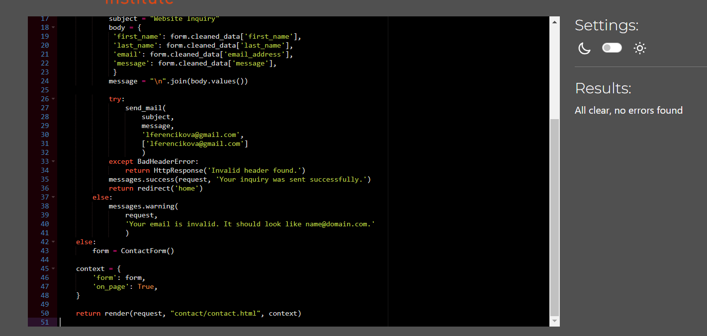

# Testing
- [Testing](#testing)
  - [Code Validation](#code-validation)
    - [HTML Testing](#html-testing)
    - [Python Testing](#python-testing)
    - [JavaScript Validation](#javascript-validation)
    - [CSS Testing](#css-testing)
  - [Browser Compatibility](#browser-compatibility)
  - [Responsiveness Test](#responsiveness-test)
  - [Fixed Bugs](#fixed-bugs)
  - [Unfixed Bugs](#unfixed-bugs)
  - [Additional Testing](#additional-testing)
    - [Lighthouse](#lighthouse)
    - [Results from Lighthouse](#results-from-lighthouse)
    - [User Stories Testing](#user-stories-testing)
    - [Manual Testing](#manual-testing)

## Code Validation

[Back to top](#testing)
### HTML Testing

I used [HTML W3C Validator](https://validator.w3.org) to validate all of my HTML files.

I followed a different approach for validating my HTML for this project as all of my pages contain Jinja syntax such as '' and '{{ form|crispy }}' and most require user authentication to avoid html validation errors. I followed the steps below:

- I gradually opened each html page on my heroku deployed app.
- I right clicked on the screen and chode 'View page source' towards the bottom of the menu.
- I copied the source code.
- I pasted the copied code into the [validate by input](https://validator.w3.org/#validate_by_input) option.
- I checked for errors and warnings, fixed any issues, revalidated by following the above steps and recorded the results.

I would do html validation at different stages of the development to avoid being overwhelmed by multiple errors at the end of the project development.

All HTML pages were validated and received a 'No errors or warning to show' for code that I had written. The image was identical for all pages, so I'm including if here for illustration.

| HTML Source Code/Page | Errors | Warnings |
| ---- | ------ | -------- |
| Home | 0 | 0 |
| All Books (including filtering and sorting) | 0 | 0 |
| Book Detail | 0 | 0 |
| Register | 0 | 0 |
| Log In | 0 | 0 |
| Logout| 0 | 0 |
| Profile | 0 | 0 |
| Admin Dashboard | 0 | 0 |
| Admin Add Product | 0 | 0 |
| Admin Edit Product | 0 | 0 |
| Admin Delete Product | n/a due to deletion modal | n/a |
| Admin Add Article | 0 | 0 |
| Admin Edit Article | 0 | 0 |
| Admin Delete Article | n/a due to deletion modal | n/a |
| Admin Add Enquiry | 0 | 0 |
| Admin Edit Enquiry | 0 | 0 |
| Admin Delete Enquiry | n/a due to deletion modal | n/a |
| Order History | 0 | 0 |
| Wishlist | 0 | 0 |
| Bag - Empty | 0 | 0 |
| Bag - Products | 0 | 0 |
| Checkout | 0 | 0 |
| All Articles | 0 | 0 |
| Article Detail | 0 | 0 |
| Contact Us | 0 | 0 |
| Enquiries | 0 | 0 |
| Newsletter | 0 | 0 |
| Error 403 | 0 | 0 |
| Error 404 | 0 | 0 |
| Error 500 | 0  | 0 |
| Footer | Privacy Policy | [multiple errors](./testing-images/html_privacy_policy_error.png) | x |
| Footer | Terms and Conditions | [multiple errors](./testing-images/html_terms_and_conditions_errors.png) | x |

There were multiple errors in both the Privacy Policy and the Terms and Conditions. Both of these html files were downloaded from termly.io. I didn't attempt to correct the errors as I feared that I would break the document and it would not render correctly. This is perhaps because the service was provided for free. For my future projects, I would look for a better source of these documents.

### Python Testing
[CI Python Linter](https://pep8ci.herokuapp.com/#) was used to validate the Python files which were created or edited by me. I regularly checked my code in my environment and corrected mistakes as I went. I shortened the lines where possible, but in a few places I felt splitting the code would make it illegible. In such cases I used `# noqa` to ignore the length of the line.

| Feature | admin | forms | models | urls | views | extra |
|---------|----------|----------|-----------|---------|----------|-------|
| Article | none  | none  | none  | none  | none  | none   |
| Bag | n/a |n/a | n/a | none  | none  | n/a  |
| Bookstore Managegement | n/a |n/a | n/a | none  | none  | n/a  |
| Checkout | none  | none  | none  | none  | none  | none , none , none   |
| Contact | n/a | none  | n/a | none  | none  | n/a  |
| Enquiry |  none  | none  | none  | none  | none  | n/a |
| Home | n/a |n/a | n/a | none  | none  | n/a  |
| Newsletter | n/a |n/a | n/a | none  | none  | n/a  |
| Products | none  | none  | none  | none  | none  | none   |
| Profile |  n/a | none  | none  | none  | none  | n/a |
| Review |  none  | none  | none  | none  | none  | n/a |
| Wishlist | none  | none  | none  | none  | none  | none   |

[Back to top](#testing)

### JavaScript Validation

[JSHint](https://jshint.com/) was used to validate the JavaScript code added to the project. External JS, for Bootstrap, jQuery and Fontawesome purposes were not validated through JSHint.

| Page | Screenshot | Errors | Warnings |
|---------|----------|----------|-----------|
| Bag - Quantity Update/Remove Script |  | none | none |
| Checkout - Stripe Script |  | none | none |
| Products - Quantity Input Script |  | none  | none |
| Products - Sorting Script |  | none | none |
| Edit Product Image Script |  | none | none |
| Profile - Country Field Script |  | none | none |
| Back to Top Button |  | none | none |
### CSS Testing
[W3C CSS Validator](https://jigsaw.w3.org/css-validator/) was used to validate my CSS files. External CSS for Bootstrap, provided by CDN was not tested. No errors were found.

To avoid cluttering my testing file with multiple identical images, I have not included every screenshot of the CSS validations, as they were all the same. 

| CSS File | Errors | Warnings |
| ---- | ------ | -------- |
| Base CSS | 0 | 0 |
| bag | 0 | 0 |
| Checkout | 0 | 0 |
| Profiles | 0 | 0 |

## Browser Compatibility

The website was tested on the following browsers: Google Chrome, Safari, Microsoft Edge and Mozilla Firefox. There were no errors discovered in the functionality of the site or the individual features.

| App | Browser Compatibility |
| ---- | ---------- |
| Google Chrome | &check; |
| Safari | &check; |
| Microsoft Edge| &check; |
| Mozilla Firefox| &check; |

[Back to top](#testing)

## Responsiveness Test

Achieving responsiveness on this project was much easier and faster than before mainly due to the application of Bootstrap. I always strived to put mobile devices first and then I used medie queries for larger devices, as it is proven that majority of internet users are accessing web apps through their mobile phones.

Testing of responsive design was carried out manually by utilizing [Google Chrome DevTools](https://developer.chrome.com/docs/devtools) and [Responsive Design Checker](https://www.responsivedesignchecker.com/).

|        | S Galaxy 5 | iPhone 6/6S/7 | iPad Mini | iPad Pro | Display <1200px | Display >1200px |
| ------ | ---------- | ------------- | --------- | -------- | --------------- | --------------- |
| Render | pass       | pass          | pass      | pass     | pass            | pass            |
| Images | pass       | pass          | pass      | pass     | pass            | pass            |

[Responsiveness test video](./readme-images/responsivness_test.webm)

[Back to top](#testing)

## Fixed Bugs

|                                        BUG                                       | WHERE |                                      HOW                                      |                   COMMIT                   |
|:--------------------------------------------------------------------------------:|:-----:|:-----------------------------------------------------------------------------:|:------------------------------------------:|
| The quantity of books in the shopping bag was not updating.| bag.html  | I had to take away the "href" element from the respective buttons.| [b3393b9](https://github.com/lucia2007/bookwormkid/commit/b3393b91866a5edf35f3e44bdd5cc408c3a815cb)  |
| The crispy_forms were not loading correctly | settings.py  | I had to correct a typo.| [af52cfe](https://github.com/lucia2007/bookwormkid/commit/af52cfe5f13c18af0ea7817c1164507551d9b475)  |
| The 404 page was not applying custom template | settings.py  | I had to move content from settings.py to urls.py| [af52cfe](https://github.com/lucia2007/bookwormkid/commit/f60afce6a6725faf30e0ae3b6ba7b95f1e5845df) and [3c048ce](https://github.com/lucia2007/bookwormkid/commit/3c048cebbd26b0f8a9c2ddeec379d0b1976da38c) |
| The 403 and 500 error pages were not applying custom template | views.py, urls.py  | I had made several messy commits trying to see if the error pages worked on the deployed app. In the end I reverted to the simplest option, just define error pages in the templates directory without any views.py or urls.py error code| [ and several previous commits](https://github.com/lucia2007/bookwormkid/commit/307f044cdbea30b665fed8fad6a2702213ab3aa5)
| My user registration and email sending for order confirmation stopped working | settings.py, gmail, heroku  | I'll provide a more detailed explanation below*. | [a960055](https://github.com/lucia2007/bookwormkid/commit/a960055f60ad0a04dc4192ae04a5a7e9c790ee9b) and [965c607](https://github.com/lucia2007/bookwormkid/commit/965c607c8a8115a25ff0d8d199aeccf2f7cf8f40)
| "Country" label was appearing twice in my checkout form | checkout/forms.py  | I had to correct the indentation error. | [1b653a2](https://github.com/lucia2007/bookwormkid/commit/1b653a2269432d69ce9bb975befc7c77253bb056)
| Wishlist items were rendering incorrectly | wishlist.html  | I had several indentation errors and wrong order of elements which I had to fix. | [d34b771](https://github.com/lucia2007/bookwormkid/commit/d34b7719ce77c698882f2e196511dd930ce3bb9c)
| My Wishlist context processor wasn't working due to inconsistencies in the code. | wishlist/contexts.py  | I had to correct the variable names in the file. | [81af4d7](https://github.com/lucia2007/bookwormkid/commit/81af4d793bc781c0e49183faaa7d9b322c0f5788)
| Noimage placeholder picture was not displaying for articles if no image provided. | article/models.py  | I had to get rid of default=placaholder for the image in the model. | [230333b](https://github.com/lucia2007/bookwormkid/commit/230333bfd2a23d9d75752c0d82a983e7785323ad) and [6a935d8](https://github.com/lucia2007/bookwormkid/commit/6a935d8f37bfcfdba8816842b5de491ed9f88f51)
| Adding a draft of an article would take me to a 404 page | article/views.py  | I had to update my views, espcially take away the status=1 condition from my detail views. | [692d357](https://github.com/lucia2007/bookwormkid/commit/692d357d724180422312cac204d2658e11846187)
| Article edit picture was not working - tip from tutor| article/views.py  | I had to add request.files to my view | [9728fc8](https://github.com/lucia2007/bookwormkid/commit/9728fc809f60383ea2b28eca683dde7bd342af25)
| Class "{%" duplicated| products.html  | products.html| I had change the place where I added the condition for filters** | [dccafb7](https://github.com/lucia2007/bookwormkid/commit/dccafb7b55aec72f89a381019eabd77c4caec305)
| Avoid anonymous user error for reviews  | product_detail.html, products/views.py| I had to switch the order of the conditions | [e9e9b23](https://github.com/lucia2007/bookwormkid/commit/e9e9b23a5b90202e3bc693b736833941e565847a)
| 'AnonymousUser' object is not iterable (max 1 review) and wrong rendering  | products.html, product_detail.html, products/views.py| I had to switch the order of the if conditions and add a @login_required decorator to my view| [59fc46d](https://github.com/lucia2007/bookwormkid/commit/59fc46daea23bf228de2c7288e244c4100fb96c6)
| Div not persmissible under small + extra space in tab= -1  | articles.html, article_detail.html, article_deletion.html | I had to change small to div and add classes, and delete an extra space in tabindex=" -1"| [2754559](https://github.com/lucia2007/bookwormkid/commit/2754559bd3b5a4a9f711a69e0f4a4f13d1dd2d61)
| Fix duplicate id="id_image" (I wasn't able to add an image to an article) | articles.html, add/edit_article.html, products.html, add/edit_product.html, custom_clearable_file_input.html | I had to get rid on id="new-image", as it was creating a duplicate id, and had to add/change js which worked with "new-image"| [6f0cf78](https://github.com/lucia2007/bookwormkid/commit/6f0cf78c2697b1de4f6a7c592ea235dc924ee49b)

* My registration and email confirmation for orders stopped working for all users but admin. This was partly due to the fact, that I attempted to use aws ses functionality for sending emails for my contact form. I later found out that aws ses in the basic version would allow sending emails only to verified email addresses, which couldn't be done when a new user was being created, as his email address was new and not verified. I found out that if I used a "helping email address" success@simulator.amazonses.com, everything worked fine. If I wanted aws ses to send emails to nonverified email address, I would have to ask for a personal approval from Amazon. As it was proving quite complicated, I opted to revert back to the previous smtp functionality. Neverthless, the problem persisted even after that. With tutor support we were able to discover that my "app password" in my gmail account got deleted (without any action on my side) and thus the email functionality stopped working. When I created a new app and reset the password in Heroku, everything started working again. I hope this problem doesn't happen again, as it's completely out of my control if Google decided to delete my "app password" for some reason.
[Error due to deleted app password](/testing_images/smtp_error.png)

** There are quite a few commits around my product filters and highlighting of the chosen age segment, as I was trying to figure out ways how to do it more efficiently and more simply. There was a lot of back and forth, and some unnecessary or duplicated commits, and even though I know the code could still be refactored, I feel that at the moment it is finally easily legible and understandable.
## Unfixed Bugs

[Back to top](#testing)

## Additional Testing
### Lighthouse

The application was also tested using [Google Lighthouse](https://developers.google.com/web/tools/lighthouse) in Chrome Developer Tools. The following aspects were tested:

- Performance - reveals how the site performs during loading
- Accessibility - shows if the site if accessible for all users and suggests ways to improve it
- Best Practices - indicates if the site conforms to industry best practices
- SEO - Search Engine Optimisation - shows if the site is optimised for search engine result rankings

### Results from Lighthouse
| Page | Validation Results |
| ---- | ---------- |
| Home | [Home Page Score](./testing-images/lighthouse_homepage.png) |
| Contact Us | [Contact Us Score](./testing-images/lighthouse_contactus.png) |
| Products | [Products Score](./testing-images/lighthouse_products.png) |
| Product Details | [Product Details](./testing-images/lighthouse_product_detail.png) |
| Admin Dashboard | [Admin Dashboard](./testing-images/lighthouse_admin_dashboard.png) |
| Shopping Bag | [Shopping Bag Score](./testing-images/lighthouse_shopping_bag.png) |
| Checkout | [Checkout Score](./testing-images/lighthouse_checkout.png) |
| Articles | [Articles Score](./testing-images/lighthouse_articles.png) |
| Article Details | [Article Details](./testing-images/lighthouse_article_detail.png) |
| Wishlist | [Wishlist Score](./testing-images/lighthouse_wishlist.png) |
| Profile | [Profile Score](./testing-images/lighthouse_profile.png) |
| Enquiries | [Enquiries Score](./testing-images/lighthouse_enquiries.png) |
| Sign In | [Sign In Score](./testing-images/lighthouse_login.png) |
| Sign Up | [Sign Up Score](./testing-images/lighthouse_signup.png) |
| Sign Out | [Sign Out Score](./testing-images/lighthouse_logout.png) |

I continuously worked on improving the individual scores and tried to reflect on the warnings in the Lighthouse which lead to the score increase. For increasing accessibility I had to change many button names as I was not using their explicit description and for performance I used [tiny png](tinypng.com) and [convertio](convertio.co) and [i love img](https://www.iloveimg.com/) to decrease their size and change them to webp where possible. However, I couldn't do this for all of my images, espcially for the book covers, as sometimes I was not able to find a large enough image of a book I needed.

All of my scores for all of the pages were above 90, often close to 100. On a couple of pages the "SEO" score is slightly lower. This is due to the presence of a "back to top" button which has no href value and thus is not crawlable. I also got a lower score on Best Practices, due to [issues](./testing-images/stripe_cookies.png) which were logged into the console and have to do with using stripe cookies. Sometimes my scores for performance differed, probably due to current connection speed.

### User Stories Testing
[Back to top](#testing)

### Manual Testing

[Back to top](#testing)